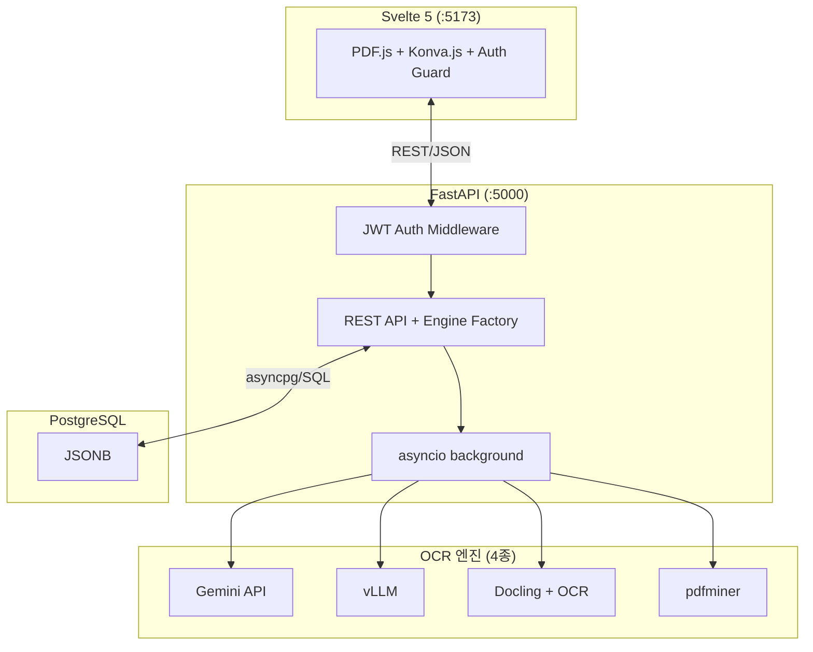

# saegim (새김)

한국어 문서 VLM 벤치마크를 위한 Human-in-the-Loop 레이블링 플랫폼.

PDF 문서를 업로드하면 페이지별 이미지로 변환하고,
웹 기반 에디터에서 레이아웃 요소의 바운딩 박스·카테고리·속성을 레이블링하여
[OmniDocBench](https://github.com/opendatalab/OmniDocBench) 표준 JSON으로 내보내는 도구입니다.

## 아키텍처



## 주요 기능

- **PDF 업로드 및 변환**: PDF를 페이지별 고해상도 PNG로 자동 변환
- **다중 인스턴스 OCR 엔진**: 프로젝트별 엔진 등록·관리 (Gemini API, vLLM, Docling+OCR)
- **텍스트/이미지 자동 추출**: OCR 엔진으로 레이아웃+텍스트 추출, 수락 시 어노테이션에 반영
- **자동 속성 분류**: 페이지/테이블/텍스트/수식 속성 자동 분류
- **캔버스 에디터**: 바운딩 박스 생성·편집·삭제, 줌/패닝, 키보드 단축키
- **읽기 순서 에디터**: 드래그앤드롭 재정렬 + 캔버스 오버레이 (`O` 단축키)
- **관계 도구**: 요소 간 관계 CRUD + SVG 화살표 시각화
- **OmniDocBench 레이블링**: 15종 Block-level + 4종 Span-level 카테고리, 페이지/요소 속성 편집
- **인증/인가**: JWT 기반 인증, 시스템 역할 (admin/annotator/reviewer)
- **관리자 대시보드**: 유저/프로젝트/시스템 통계 관리
- **프로젝트 관리**: 프로젝트 → 문서 → 페이지 계층 구조
- **JSON Export**: OmniDocBench 표준 포맷으로 내보내기

## 기술 스택

| 계층 | 기술 |
| ---- | ---- |
| **프론트엔드** | Svelte 5 (Runes), TypeScript, Vite 7, Tailwind CSS 4, Konva.js, PDF.js |
| **백엔드** | Python 3.13+, FastAPI, asyncpg (raw SQL), Pydantic |
| **인증** | JWT (access token in-memory + refresh token HttpOnly cookie) + bcrypt |
| **데이터베이스** | PostgreSQL 15+ (JSONB) |
| **PDF 처리** | pypdfium2 (2x 해상도 렌더링) + pdfminer.six (텍스트/이미지 자동 추출) |
| **OCR 엔진** | 4종 Strategy 패턴 (`BaseOCREngine` ABC) |
| **비동기 태스크** | asyncio 백그라운드 태스크 |
| **패키지 관리** | Backend: uv / Frontend: Bun |
| **E2E 테스트** | Vitest + Docker Compose |

## OCR 엔진 아키텍처

프로젝트별 `ocr_config` JSONB에 다수의 엔진 인스턴스를 등록하고,
`default_engine_id`로 기본 엔진을 지정합니다. 같은 타입의 엔진을 여러 개 등록할 수 있습니다:

| Engine Type | 설명 | 외부 서비스 |
| --- | --- | --- |
| `pdfminer` (폴백) | pdfminer.six 기본 추출 (GPU 불필요, 동기) | 없음 |
| `commercial_api` | Gemini full-page VLM 분석 | Gemini API |
| `vllm` | vLLM OpenAI-compatible VLM 서버 | vLLM 서버 |
| `split_pipeline` | Docling 레이아웃 + 외부 OCR | Docling (로컬) + Gemini/vLLM |

## 프로젝트 구조

```text
saegim/
├── saegim-backend/           # FastAPI 백엔드
│   ├── src/saegim/
│   │   ├── api/routes/       # REST 엔드포인트
│   │   ├── schemas/          # Pydantic 스키마 (EngineType, OcrConfig 등)
│   │   ├── services/
│   │   │   ├── engines/      # OCR 엔진 Strategy 패턴
│   │   │   │   ├── base.py, factory.py
│   │   │   │   ├── pdfminer_engine.py
│   │   │   │   ├── commercial_api_engine.py
│   │   │   │   ├── vllm_engine.py
│   │   │   │   └── split_pipeline_engine.py
│   │   │   ├── layout_types.py
│   │   │   ├── docling_layout_service.py
│   │   │   ├── gemini_ocr_service.py
│   │   │   ├── vllm_ocr_service.py
│   │   │   └── ocr_pipeline.py
│   │   ├── repositories/     # asyncpg raw SQL
│   │   └── core/             # DB 커넥션 풀
│   ├── migrations/           # SQL 마이그레이션
│   └── tests/                # pytest 테스트
│
├── saegim-frontend/          # Svelte 5 SPA (SvelteKit + adapter-static)
│   ├── src/
│   │   ├── routes/           # SvelteKit 파일 기반 라우트
│   │   └── lib/
│   │       ├── api/          # FastAPI 호출 + 타입
│   │       ├── components/   # canvas/, panels/, settings/
│   │       ├── stores/       # Svelte 5 Runes 상태관리 (annotation, canvas, pdf, ui)
│   │       ├── types/        # OmniDocBench 타입 정의 + element-groups
│   │       └── utils/        # bbox, color, interaction, text-layout, text-selection
│   └── tests/                # Vitest 테스트
│
├── e2e/                      # E2E 테스트
│   ├── docker-compose.e2e.yml
│   ├── tests/                # 기본 테스트 (Vitest)
│   └── tests/gpu/            # GPU 전용 (vLLM Chandra)
│
└── docker-compose.yml        # 개발/배포용
```

## 빠른 시작

### Docker Compose (권장)

```bash
cp .env.example .env
docker compose up -d --build
```

| URL | 설명 |
| --- | ---- |
| <http://localhost:13000> | 프론트엔드 |
| <http://localhost:15000/docs> | Swagger UI |

### 로컬 개발

```bash
# 백엔드
cd saegim-backend
uv sync --group dev --group docs --extra cpu    # CPU only (또는 --extra cu128)
uv run uvicorn saegim.app:app --reload --host 0.0.0.0 --port 5000

# 프론트엔드
cd saegim-frontend
bun install
bun run dev
```

## 개발

```bash
# 백엔드
uv run ruff format                  # 포맷팅
uv run ruff check --fix             # 린트
uv run ty check                     # 타입 체크
uv run pytest --cov                 # 테스트 + 커버리지

# 프론트엔드
bun run check                       # 타입 체크
bun run test                        # 테스트
bun run build                       # 프로덕션 빌드

# E2E 테스트
cd e2e
bun run docker:up && bun run test   # 기본 테스트
bun run docker:gpu:up && bun run test:gpu  # GPU 테스트
```

## 상세 문서

| 문서 | 설명 |
| ---- | ---- |
| [아키텍처 개요](architecture/README.md) | 시스템 구조, 기술 스택, 인증 |
| [백엔드 아키텍처](backend/architecture/architecture.md) | 레이어드 아키텍처, 데이터 흐름 |
| [프론트엔드 아키텍처](frontend/architecture/architecture.md) | 컴포넌트 구조, 상태 관리 |
| [API 가이드](backend/guide/api.md) | REST API 엔드포인트 (Auth, Admin 포함) |
| [멀티유저 협업](architecture/multi-user-collaboration.md) | 인증, 역할, 태스크 워크플로우 |
| [백엔드 시작하기](backend/guide/getting-started.md) | 개발 환경 설정 |
| [E2E 테스트](../e2e/README.md) | E2E 테스트 가이드 |
| [플래닝 가이드](../AGENTS.md) | 프로젝트 비전, 로드맵 |
