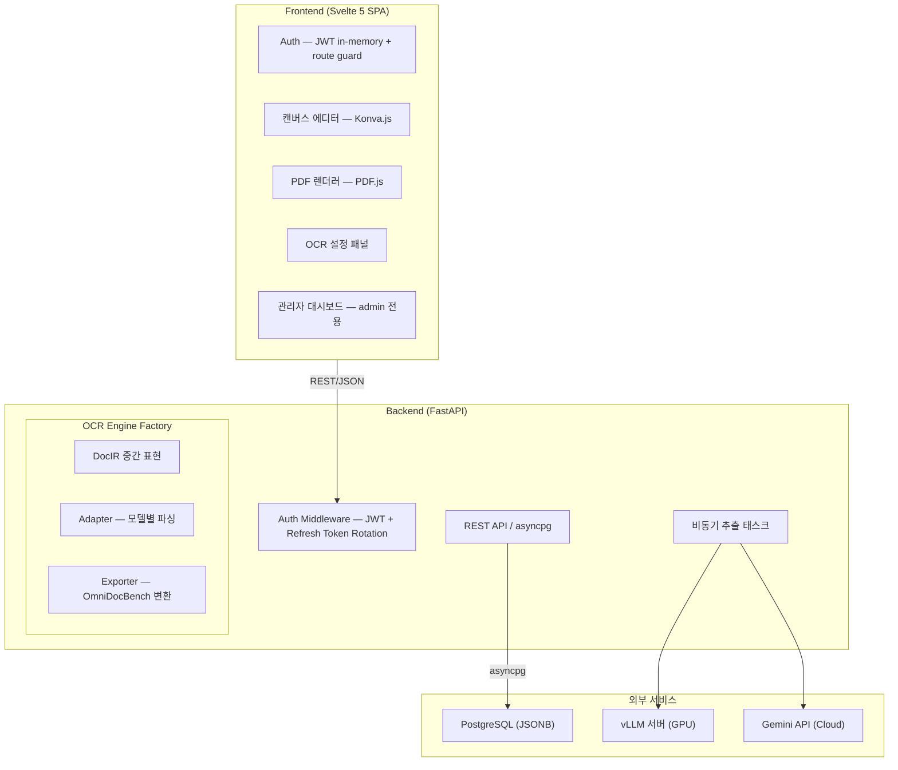

# 아키텍처 문서

saegim의 시스템 아키텍처를 구성 요소별로 설명한다.

## 전체 구조

## 기술 스택

| 계층 | 기술 |
| ---- | ---- |
| **프론트엔드** | Svelte 5 (Runes), TypeScript, Vite 7, Tailwind CSS 4, Konva.js, PDF.js |
| **백엔드** | Python 3.13+, FastAPI, asyncpg (raw SQL), Pydantic |
| **인증** | JWT (access token in-memory + refresh token HttpOnly cookie) + bcrypt |
| **데이터베이스** | PostgreSQL 15+ (JSONB) |
| **PDF 처리** | pypdfium2 (2x 해상도 렌더링) + pdfminer.six (텍스트/이미지 자동 추출) |
| **OCR 엔진** | 4종 Strategy 패턴 (`BaseOCREngine` ABC) |
| **비동기 태스크** | asyncio 백그라운드 태스크 |
| **패키지 관리** | Backend: uv / Frontend: Bun |
| **E2E 테스트** | Vitest + Docker Compose |

## 문서 목록

### 핵심 파이프라인

| 문서 | 설명 |
| ---- | ---- |
| [자동 추출 파이프라인](extraction-pipeline.md) | OCR 엔진 아키텍처, 엔진 타입별 흐름, `ocr_config` 구조 |
| [DocIR 아키텍처](docir-architecture.md) | 3-stage 파이프라인 (Provider-Adapter-Exporter), 중간 표현, 모델 카탈로그 |

### 데이터 및 레이블링

| 문서 | 설명 |
| ---- | ---- |
| [데이터 스키마](data-schema.md) | DB 테이블, JSONB 구조, OmniDocBench 포맷 |
| [레이블링 워크플로우](labeling-workflow.md) | 에디터 UI, 캔버스 레이어, 키보드 단축키 |
| [데이터 큐레이션](data-curation.md) | 데이터 검증, 품질 관리, 내보내기 |

### 인증 및 운영

| 문서 | 설명 |
| ---- | ---- |
| [다중 사용자 협업](multi-user-collaboration.md) | JWT 인증, 역할 관리, 태스크 워크플로우, 관리자 대시보드 |

## 읽는 순서

1. 전체 흐름을 이해하려면 [자동 추출 파이프라인](extraction-pipeline.md)부터 읽는다.
2. OCR 모델 추가/변경이 목적이면 [DocIR 아키텍처](docir-architecture.md)를 참고한다.
3. 데이터 구조를 파악하려면 [데이터 스키마](data-schema.md)를 읽는다.
4. 레이블링 UI를 수정하려면 [레이블링 워크플로우](labeling-workflow.md)를 읽는다.
5. 인증/인가 시스템을 이해하려면 [다중 사용자 협업](multi-user-collaboration.md)을 읽는다.
