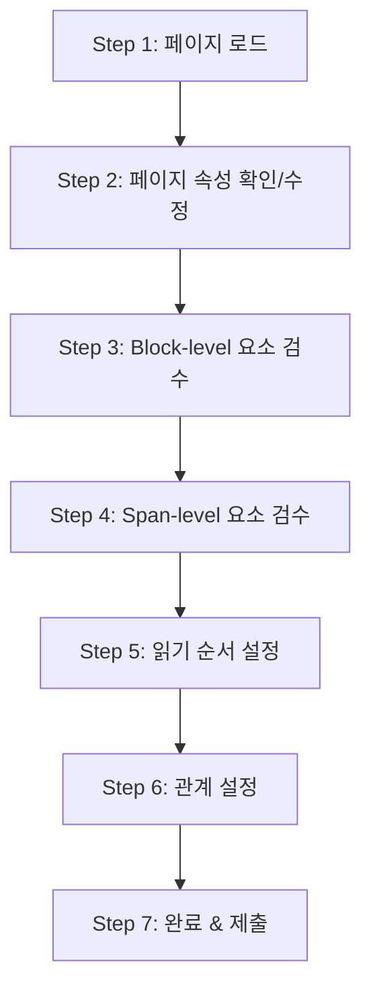

# 레이블링 UI 워크플로우

## 어노테이터 작업 흐름

각 단계 상세:

1. **페이지 로드**: 자동 추출 결과가 bbox로 오버레이된 이미지 확인
2. **페이지 속성**: data_source, language, layout, watermark 등 드롭다운 선택
3. **Block-level 검수**:
   - category_type 확인/변경, bbox 위치/크기 조정
   - 카테고리별 attribute labels 부여 (text_block → text_language 등)
   - text/latex/html 내용 검수, ignore 토글
   - 새 요소 그리기 시 OCR 엔진 선택 팝업
4. **Span-level 검수**: Block 내부 line_with_spans 편집
5. **읽기 순서**: 드래그 재정렬 또는 직접 숫자 입력
6. **관계 설정**: figure↔caption, table↔caption/footnote, truncated 관계
7. **제출**: 자동 검증 통과 확인 후 제출

## UI 핵심 기능 요구사항

| 기능 | 설명 | 우선순위 |
| ------ | ------ | --------- |
| 이미지 줌/패닝 | 고해상도 문서를 자유롭게 확대/축소 | P0 |
| Bbox 생성/편집/삭제 | 사각형 드로잉, 꼭짓점 드래그, 삭제 | P0 |
| Category 선택 | 드롭다운 또는 단축키 지정 | P0 |
| Attribute 패널 | 카테고리에 따라 동적으로 표시되는 속성 입력 | P0 |
| 텍스트 편집 패널 | text / latex / html 인라인 편집 | P0 |
| 읽기 순서 에디터 | 번호 표시 오버레이 + 순서 변경 | P1 |
| Relation 연결 | 두 요소를 선택하여 관계 라벨 부여 | P1 |
| 키보드 단축키 | 카테고리 빠른 전환, 다음/이전 요소 이동 | P1 |
| Undo/Redo | 모든 편집 작업의 되돌리기 | P1 |
| 자동 저장 | 주기적 자동 저장 (작업 유실 방지) | P1 |
| ~~미니맵~~ | ~~전체 페이지 축소 보기에서 현재 위치 표시~~ | ~~P2~~ (구현 예정 없음) |
| ~~비교 뷰~~ | ~~원본 이미지 vs 레이블링 결과 나란히 보기~~ | ~~P2~~ (구현 예정 없음) |
