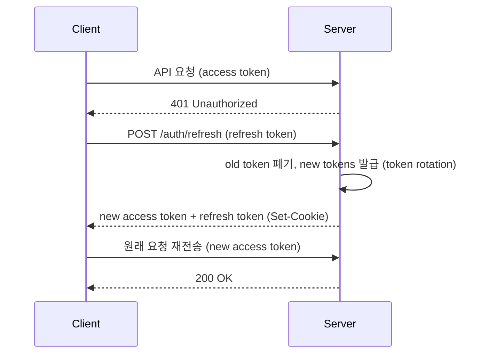
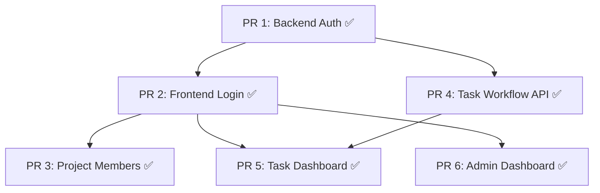
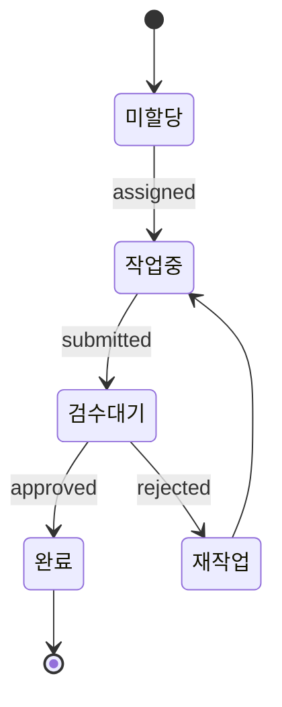

# 멀티유저 협업

## 현재 상태

### 구현 완료

- **JWT 인증**: access token (in-memory) + refresh token (HttpOnly cookie)
  - Token rotation with family-based theft detection
  - Grace period for multi-tab support
  - bcrypt 12 rounds password hashing
  - 최초 유저 → admin 자동 부여
- **프론트엔드 인증**: 로그인/회원가입 페이지, auth guard, proactive token refresh (1분 주기)
- **관리자 대시보드**: 유저 관리, 프로젝트 통계, 시스템 현황
- **기존 라우트 보호**: 모든 API 엔드포인트에 `get_current_user` auth middleware 적용
- **프로젝트 멤버 관리**: `project_members` 테이블 CRUD, 멤버십 기반 프로젝트 접근 제어
- **태스크 워크플로우 API**: 할당/제출/승인·반려, `locked_at` 30분 타임아웃 동시 편집 방지
- **프론트엔드 태스크 UI**: 태스크 대시보드 (`/tasks`), 검수 큐 (`/projects/[id]/review`), 상태 배지

### 미구현

- 작업 현황 보드 (프로젝트 전체 진행률)

## 목표

공용 인터페이스에서 벗어나 여러 사용자가 프로젝트를 공유하고,
역할 기반으로 레이블링 작업을 분담·검수하는 환경을 구축한다.

## 역할 체계 (2계층)

시스템 수준과 프로젝트 수준의 역할을 분리한다.

### 시스템 역할 (`users.role`)

| 역할 | 권한 |
| ---- | ---- |
| `admin` | 전체 사용자 관리 (CRUD, 역할 변경, 비활성화), 모든 프로젝트 접근, 시스템 설정 |
| `annotator` | 소속 프로젝트 내 작업 수행 |
| `reviewer` | 소속 프로젝트 내 검수 수행 |

### 프로젝트 역할 (`project_members.role`)

| 역할 | 권한 |
| ---- | ---- |
| `owner` | 프로젝트 설정 변경, 멤버 관리, 태스크 할당 |
| `annotator` | 할당된 페이지 레이블링 |
| `reviewer` | 제출된 페이지 검수 (승인/반려) |

**admin은 project_members에 없어도 모든 프로젝트에 접근 가능**하다 (시스템 수준 오버라이드).

### 최초 사용자 = admin

- 회원가입 시 `users` 테이블에 레코드가 0건이면 자동으로 `role = 'admin'` 부여
- 이후 가입자는 기본값 `role = 'annotator'`
- admin만 다른 사용자의 시스템 역할을 변경할 수 있다

## 인증 아키텍처

### 토큰 전략

| 토큰 | 저장 위치 | 만료 시간 | 용도 |
| ---- | --------- | --------- | ---- |
| Access Token | 메모리 (JavaScript 변수) | 15분 | API 요청 인증 |
| Refresh Token | HttpOnly Secure SameSite cookie | 7일 | Access Token 갱신 |

### 토큰 갱신 흐름

### Theft Detection (Family-based)

- 각 refresh token은 `family_id`에 속함 (로그인 시 새 family 생성)
- token rotation 시 이전 token에 `revoked_at` 기록
- 이미 폐기된 token이 재사용되면 → grace period 경과 확인
  - grace period 내: 정상 (multi-tab 지원)
  - grace period 초과: 해당 family 전체 폐기 (theft detected)

### 비밀번호 관리

- bcrypt 12 rounds (OWASP 권장)
- `must_change_password` 플래그: 관리자가 비밀번호 재설정 시 활성화
- 비밀번호 변경 시 모든 세션 무효화 (refresh token hard delete)

### Auth API

| Method | Path | 인증 | 설명 |
| ------ | ---- | ---- | ---- |
| `GET` | `/api/v1/auth/check-login-id` | 불필요 | 로그인 ID 중복 확인 |
| `POST` | `/api/v1/auth/register` | 불필요 | 회원가입 (최초 유저 → admin) |
| `POST` | `/api/v1/auth/login` | 불필요 | 로그인 (JWT 발급) |
| `POST` | `/api/v1/auth/refresh` | 불필요 | Refresh token으로 access token 갱신 |
| `POST` | `/api/v1/auth/logout` | 불필요 | Refresh token family 폐기 |
| `PATCH` | `/api/v1/auth/me/credentials` | 필요 | 로그인 ID/이메일/비밀번호 변경 |

### Admin API

| Method | Path | 인증 | 설명 |
| ------ | ---- | ---- | ---- |
| `GET` | `/api/v1/admin/users` | admin | 전체 유저 목록 |
| `PATCH` | `/api/v1/admin/users/:id` | admin | 유저 역할 변경 / 비활성화 |
| `GET` | `/api/v1/admin/projects` | admin | 전체 프로젝트 목록 (통계 포함) |
| `GET` | `/api/v1/admin/stats` | admin | 시스템 통계 |

### 프론트엔드 인증

- **AuthStore** (`auth.svelte.ts`): Svelte 5 runes 기반, token in-memory, JWT payload derived
- **HTTP Client** (`client.ts`): Bearer token 자동 주입, 401 시 silent refresh → retry
- **Proactive Refresh**: access token 만료 2분 전 자동 갱신 (1분 주기 체크)
- **Route Guard** (`+layout.svelte`): 미인증 → `/login`, `must_change_password` → `/account/security`

## 구현 단계 (PR 분할)

### 의존 관계

### PR 1: Backend Auth 기반 ✅

**브랜치**: `feat/auth-backend` | **PR**: #88

- JWT 인증 (access token + refresh token rotation)
- `users` 테이블에 `password_hash`, `login_id`, `is_active`, `must_change_password` 추가
- `refresh_tokens` 테이블 (family-based theft detection)
- `project_members` 테이블 스키마 (N:M 관계)
- Auth routes: register, login, refresh, logout, check-login-id, credentials update
- Admin routes: users list/update, projects list, system stats
- `get_current_user`, `require_admin`, `require_project_member` dependencies
- 기존 라우트에 auth middleware 적용

### PR 2: Frontend 로그인 + Auth Guard ✅

**브랜치**: `feat/auth-frontend` | **PR**: #95

- JWT 디코딩 유틸리티 (`jwt.ts`)
- AuthStore (token in-memory, derived user/role/mustChangePassword)
- HTTP client: Bearer 헤더 자동 주입, 401 silent refresh, proactive refresh
- 로그인/회원가입 페이지 (한국어 UI, shadcn-svelte)
- Route guard (`+layout.svelte`): 미인증 리다이렉트, 1분 주기 만료 체크
- Header에 admin 전용 `/admin` 링크
- 백엔드 687 tests, 프론트엔드 202 tests 통과

### PR 3: 프로젝트 멤버 관리 ✅

**브랜치**: `feat/project-members` | **PR**: #92

- `repositories/project_member_repo.py`: CRUD
- `GET/POST/PATCH/DELETE /projects/:id/members`
- 프로젝트 접근 시 멤버십 체크 (`require_project_member`)
- 프로젝트 생성 시 생성자 → owner 자동 등록
- 프론트엔드: `/projects/[id]/settings`에 멤버 관리 탭
- 백엔드 747 tests, 프론트엔드 221 tests, E2E 10 API tests 통과

### PR 4: 태스크 워크플로우 API ✅

**브랜치**: `feat/task-workflow` | **PR**: #87

- `repositories/task_repo.py`: 할당/제출/검수 로직
- `POST /pages/:id/assign`, `POST /pages/:id/submit`, `POST /pages/:id/review`
- `locked_at` 관리 (30분 타임아웃 자동 해제)
- `GET /users/me/tasks`, `GET /projects/:id/review-queue`
- `task_history` 자동 기록
- 721 tests 통과, 커버리지 84.13%

### PR 5: 태스크 대시보드 + 검수 큐 UI ✅

**브랜치**: `feat/task-dashboard` | **PR**: #91

- `/tasks` 페이지: 내 할당 목록, 상태별 필터, 진행률
- `/projects/[id]/review` 페이지: reviewer 전용 검수 큐
- 레이블링 UI에 상태 배지, locked 표시, 제출 버튼

### PR 6: 관리자 대시보드 ✅

**브랜치**: `feat/admin-dashboard` | **PR**: #102

- `/admin` 페이지 (탭 구조): 유저 관리, 프로젝트 관리, 시스템 현황
- Admin route guard (non-admin → `/` 리다이렉트)
- `src/lib/api/admin.ts`: admin API 호출 모듈
- `GET /api/v1/admin/stats` 시스템 통계 엔드포인트
- 백엔드 772 tests, 프론트엔드 245 tests 통과

## 태스크 워크플로우

### 워크플로우

### 동시 편집 방지

기존 `pages.locked_at`을 활용한다:

- 페이지 편집 시작 시 `locked_at = NOW()`, `assigned_to = current_user`
- 다른 사용자가 접근하면 "편집 중" 표시
- 타임아웃 (예: 30분) 경과 시 자동 해제

## 프론트엔드 협업 UI

### 구현 완료

| 컴포넌트 | 설명 | 접근 권한 |
| -------- | ---- | -------- |
| 로그인 페이지 (`/login`) | 로그인 ID/비밀번호 인증 | 공개 |
| 회원가입 페이지 (`/register`) | 사용자 등록 | 공개 |
| 관리자 대시보드 (`/admin`) | 유저/프로젝트/시스템 관리 | admin |

| 프로젝트 멤버 관리 (`/projects/[id]/settings`) | 초대, 역할 변경, 제거 | owner / admin |
| 태스크 대시보드 (`/tasks`) | 내 할당 목록, 상태별 필터, 진행률 | 인증된 유저 |
| 검수 큐 (`/projects/[id]/review`) | reviewer 전용, 승인/반려 UI | reviewer / admin |

### 미구현

| 컴포넌트 | 설명 | 접근 권한 |
| -------- | ---- | -------- |
| 작업 현황 보드 | 프로젝트 전체 진행률 | 멤버 |

## 리스크

| 리스크 | 완화 |
| ------ | ---- |
| 인증 보안 취약점 | bcrypt + JWT 표준 구현, OWASP 체크리스트 |
| 동시 편집 충돌 | 낙관적 락 + 타임아웃 자동 해제 |
| 역할 권한 복잡도 증가 | 미들웨어 기반 RBAC, 시스템 3종 + 프로젝트 3종으로 제한 |
| admin 계정 탈취 | 최초 admin 생성 후 추가 admin 생성 제한, 비밀번호 강도 검증 |
| Refresh token 탈취 | Family-based theft detection + token rotation |

## 선행 조건

- Phase 2 (자동 추출) 기본 완료 ✅
- `users`, `task_history` 테이블은 이미 존재 ✅
