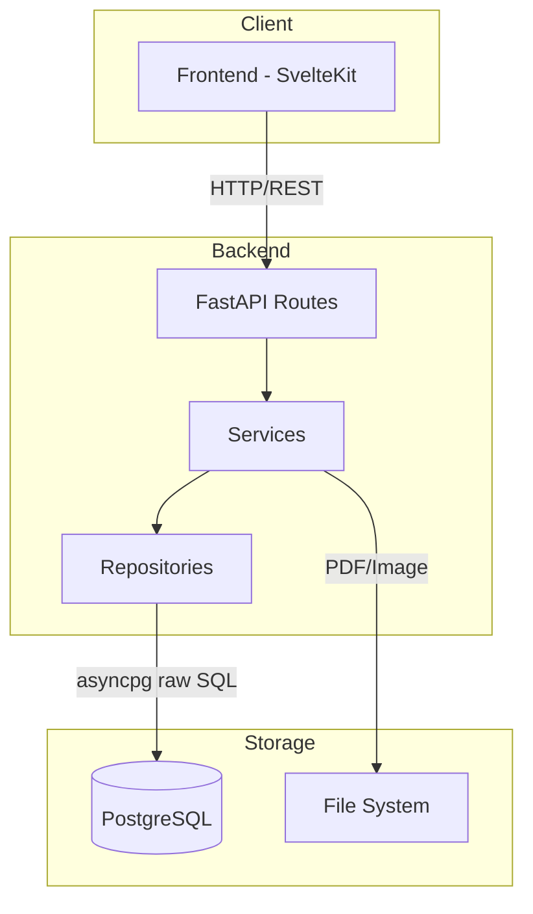
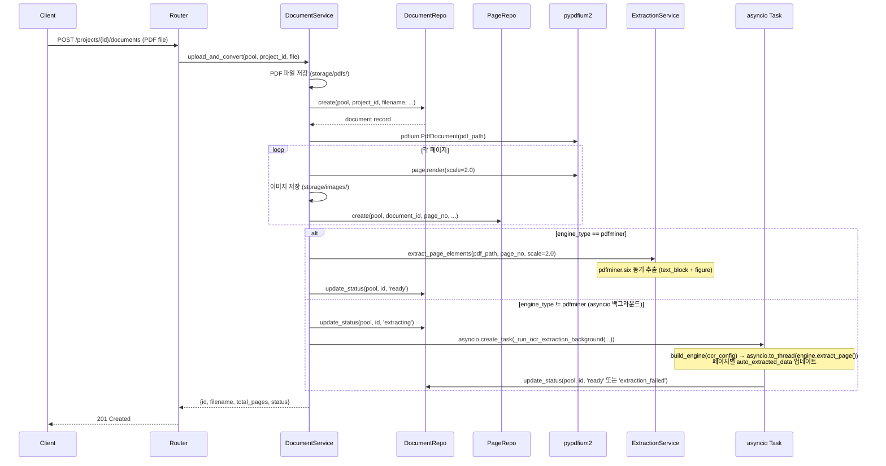
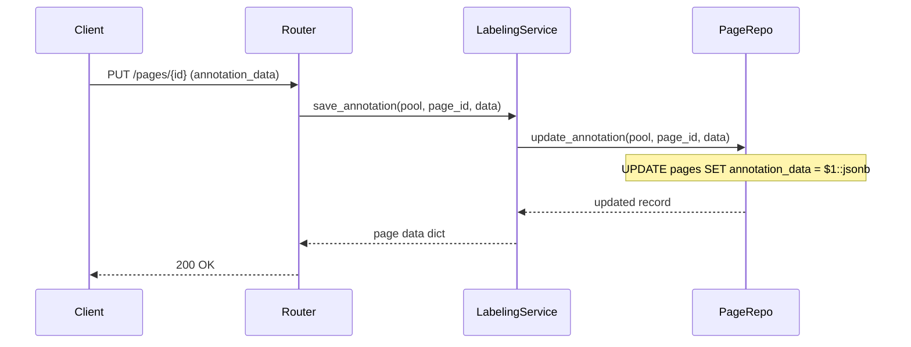
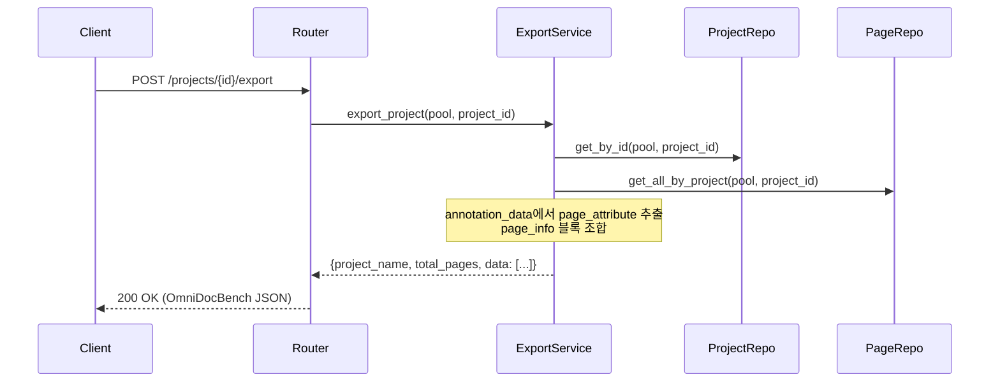
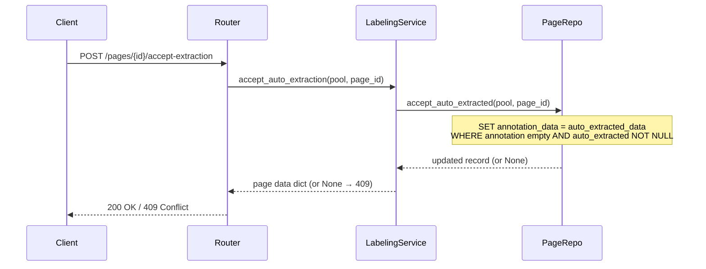

# 아키텍처

## 시스템 구조



## 레이어드 아키텍처

saegim 백엔드는 3계층 구조를 따릅니다:

### Routes (API 라우터)

HTTP 요청을 받아 적절한 서비스를 호출하고 응답을 반환합니다.

```text
src/saegim/api/routes/
├── health.py       # GET /api/v1/health
├── projects.py     # 프로젝트 CRUD (project_type, OCR 설정 포함)
├── documents.py    # 문서 업로드/조회
├── pages.py        # 페이지 레이블링
├── users.py        # 사용자 관리
├── analysis.py     # Phase 4a: 문서 분석 메타데이터 CRUD
└── export.py       # 데이터 내보내기 (OmniDocBench / VQA / OCRAG)
```

- FastAPI의 `APIRouter`를 사용
- Pydantic 스키마로 요청/응답 검증
- 모든 엔드포인트는 `/api/v1` 접두사

### Services (비즈니스 로직)

핵심 비즈니스 로직을 처리합니다.

```text
src/saegim/services/
├── engines/                       # OCR 엔진 Strategy 패턴
│   ├── base.py                    # BaseOCREngine ABC (extract_page, test_connection)
│   ├── factory.py                 # build_engine(ocr_config) 팩토리 (engine_type 분기)
│   ├── pdfminer_engine.py          # PdfminerEngine (GPU 불필요 폴백)
│   ├── commercial_api_engine.py   # CommercialApiEngine (Gemini/vLLM full-page)
│   ├── integrated_server_engine.py # IntegratedServerEngine (PP-StructureV3 또는 vLLM 자동 분기)
│   └── split_pipeline_engine.py   # SplitPipelineEngine (Layout + 외부 OCR)
├── document_service.py            # PDF 업로드 → 이미지 변환 → 추출 분기 (pdfminer/asyncio)
├── extraction_service.py          # pdfminer.six 폴백 추출 (text_block + figure)
├── ppstructure_service.py         # PP-StructureV3 HTTP 클라이언트 (PpstructureClient, LayoutRegion)
├── ocr_pipeline.py                # 2단계 파이프라인 오케스트레이터 (OcrPipeline, TextOcrProvider)
├── ocr_provider.py                # 프롬프트 상수, bbox_to_poly(), build_omnidocbench_page()
├── gemini_ocr_service.py          # GeminiOcrProvider, GeminiTextOcrProvider
├── vllm_ocr_service.py            # VllmOcrProvider, VllmTextOcrProvider
├── ocr_connection_test.py         # check_ppstructure/gemini/vllm_connection()
├── labeling_service.py            # 어노테이션 CRUD, 요소 추가/삭제, 자동 추출 수락
├── analysis_service.py            # Phase 4a: AI 문서 분석 (Overview, Core Idea, Key Figures, Limitations)
└── export_service.py              # OmniDocBench JSON 조합 (Strategy 패턴으로 VQA/OCRAG Export 확장)
```

- Repository를 호출하여 데이터 접근
- 파일 시스템 I/O 처리 (PDF 저장, 이미지 변환)
- JSONB 데이터의 JSON string/dict 파싱 처리

### Repositories (데이터 접근)

asyncpg를 사용하여 PostgreSQL에 raw SQL을 실행합니다.

```text
src/saegim/repositories/
├── project_repo.py    # INSERT/SELECT projects
├── document_repo.py   # INSERT/SELECT/UPDATE documents
├── page_repo.py       # JSONB 연산 (jsonb_set, jsonb_agg)
└── user_repo.py       # INSERT/SELECT users
```

- 모든 함수는 `asyncpg.Pool`을 첫 번째 인자로 받음
- SQL 파라미터는 `$1`, `$2` 등 positional binding 사용
- `asyncpg.Record` 객체 반환

## 데이터 흐름

### PDF 업로드 플로우



### 어노테이션 저장 플로우



### 내보내기 플로우



### 자동 추출 수락 플로우



## 커넥션 풀 관리

asyncpg 커넥션 풀은 FastAPI lifespan으로 관리됩니다:

```python
@asynccontextmanager
async def lifespan(app: FastAPI) -> AsyncIterator[None]:
    settings = app.state.settings
    await create_pool(
        settings.database_url,
        min_size=settings.db_pool_min_size,  # 기본값: 2
        max_size=settings.db_pool_max_size,  # 기본값: 10
    )
    yield
    await close_pool()
```

- 앱 시작 시 풀 생성, 종료 시 풀 해제
- `get_pool()` 함수로 모듈 레벨 풀 접근
- Repository 함수는 풀을 인자로 받아 커넥션 획득

## 정적 파일 서빙

페이지 이미지는 FastAPI `StaticFiles`로 제공됩니다:

```text
/storage/images/{document_id}_p{page_no}.png
```

`storage/images/` 디렉토리가 `/storage/images` 경로로 마운트됩니다.

## 핵심 컴포넌트 설계

### A. PDF Ingestion Service

- PDF를 페이지 단위로 고해상도 이미지(200 DPI 이상)로 변환
- 원본 PDF와 변환 이미지를 저장
- page_info (page_no, height, width, image_path) 자동 생성

### B. Auto-Extraction Pipeline

- Layout Detection: 각 페이지에서 블록/스팬 요소의 bounding box + category_type 추출
- OCR Engine: 텍스트 블록의 text 필드 채우기
- Table Recognizer: table 요소의 html/latex 필드 생성
- Formula Recognizer: 수식 요소의 latex 필드 생성
- Attribute Classifier: 페이지/블록 속성 자동 분류
- Reading Order Estimator: order 필드 자동 부여
- 모든 추출 결과를 "초안 JSON"으로 저장 → 사람 검수 단계로 전달

상세: [추출 파이프라인](../../architecture/extraction-pipeline.md)

### C. Labeling Web Interface (핵심)

- **3-layer 하이브리드 뷰어** (HybridViewer):
  - Layer 1: PDF.js `<canvas>` 벡터 렌더링 (폴백: `` 래스터 이미지)
  - Layer 2: Konva.js 캔버스 (이미지 블록 bbox + 선택된 요소)
  - Layer 3: DOM TextOverlay (텍스트 블록 — 이미지 폴백 모드만)
- **아이콘 기반 컴팩트 툴바**: 선택(S)/그리기(D)/이동(H) + 줌 퍼센트 표시
- 사이드 패널: 선택한 요소의 category, attribute, text/latex/html 편집
- PageNavigator: 다중 페이지 문서에서 `[`/`]` 키 또는 화살표로 페이지 이동
- ExtractionPreview: OCR 추출 상태 표시 + 결과 수락/무시

상세: [레이블링 워크플로우](../../architecture/labeling-workflow.md)

### D. Quality Assurance Module

- 자동 검증 규칙 (bbox가 이미지 범위 내인지, 필수 속성 누락 등)
- 교차 검증: 같은 페이지를 2명 이상이 독립 레이블링 → 불일치 리뷰
- 진행률 대시보드

### E. Export Service

- OmniDocBench JSON 포맷으로 직렬화
- 이미지 파일과 함께 패키징
- 선택적으로 KO-VLM-Benchmark 평가 스크립트와 호환되는 형식으로도 내보내기
