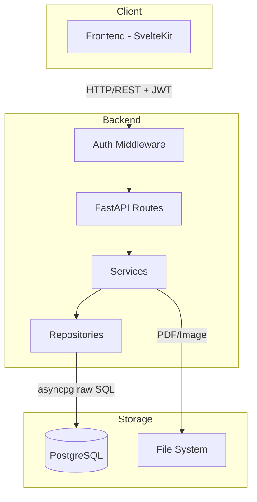
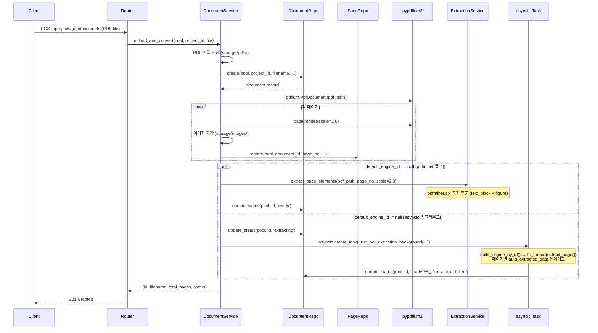
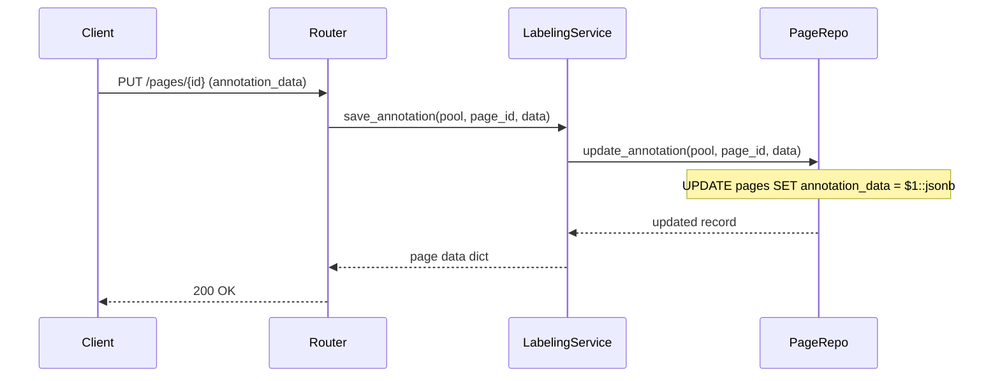
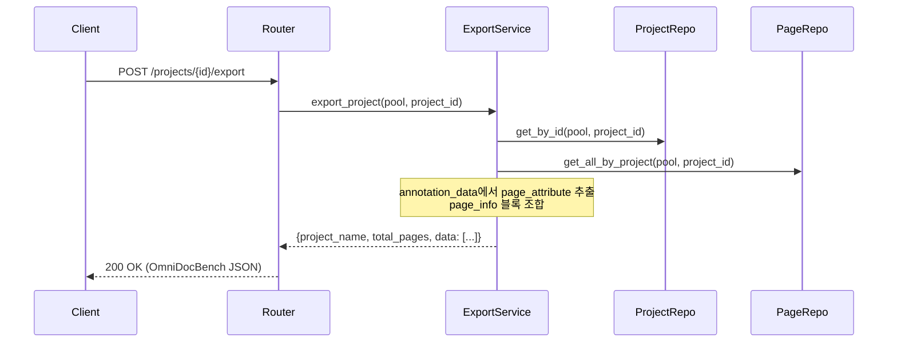
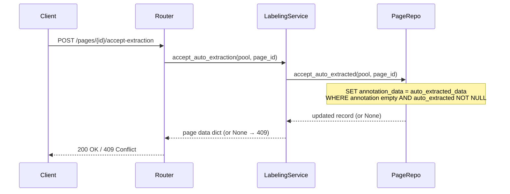
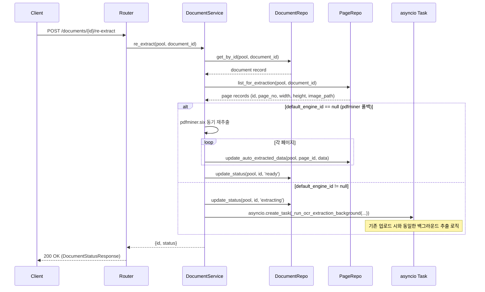
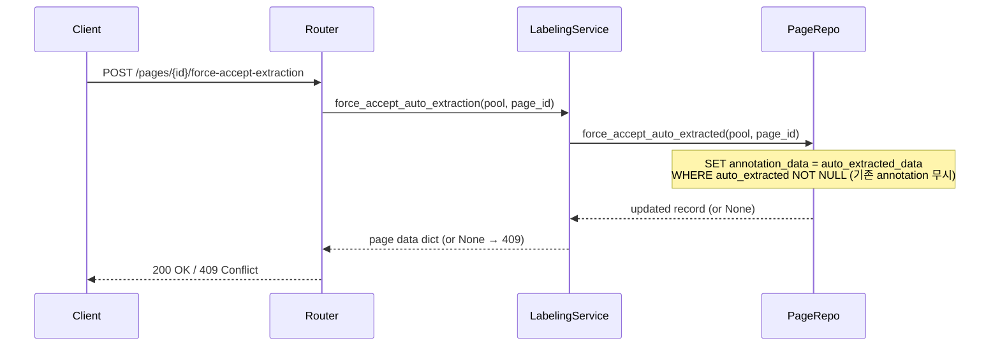
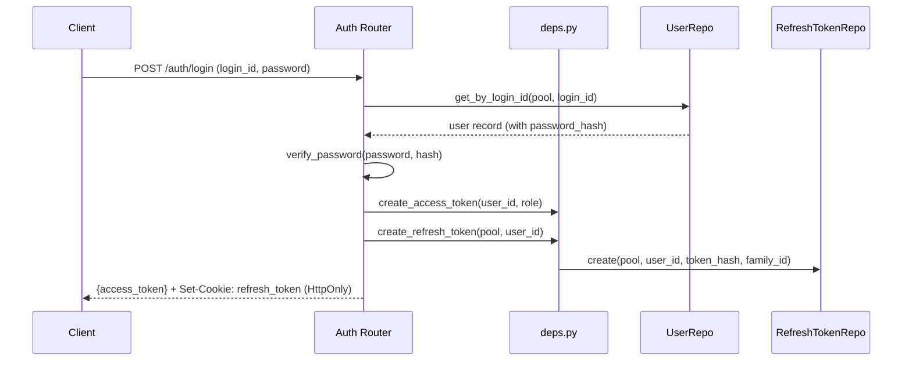
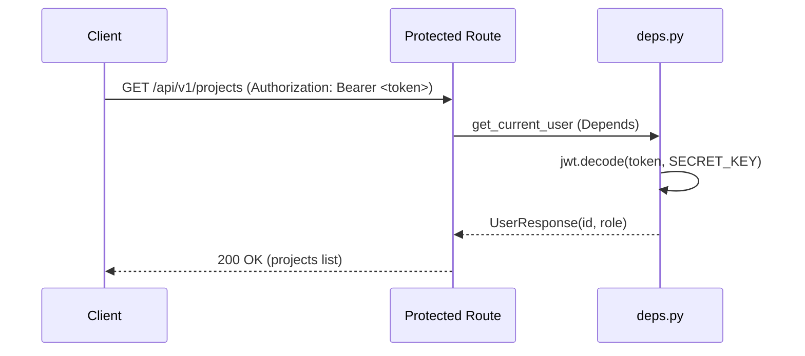

# 아키텍처

## 시스템 구조


```mermaid
graph TB
    subgraph Client
        FE[Frontend - SvelteKit]
    end

    subgraph Backend
        AUTH[Auth Middleware]
        API[FastAPI Routes]
        SVC[Services]
        REPO[Repositories]
    end

    subgraph Storage
        PG[(PostgreSQL)]
        FS[File System]
    end

    FE -->|HTTP/REST + JWT| AUTH
    AUTH --> API
    API --> SVC
    SVC --> REPO
    REPO -->|asyncpg raw SQL| PG
    SVC -->|PDF/Image| FS
```

## 레이어드 아키텍처

saegim 백엔드는 3계층 구조를 따릅니다:

### Routes (API 라우터)

HTTP 요청을 받아 적절한 서비스를 호출하고 응답을 반환합니다.

```text
src/saegim/api/
├── deps.py         # 인증/인가 dependency (get_current_user, require_admin, require_project_member)
└── routes/
    ├── health.py       # GET /api/v1/health, /health/ready
    ├── auth.py         # 회원가입, 로그인, 토큰 갱신, 로그아웃, 자격증명 변경
    ├── admin.py        # 유저/프로젝트/시스템 통계 관리 (admin 전용)
    ├── projects.py     # 프로젝트 CRUD, OCR 엔진 인스턴스 CRUD, 기본 엔진 설정
    ├── documents.py    # 문서 업로드/조회/삭제/재추출
    ├── pages.py        # 페이지 레이블링, 읽기 순서, 관계 CRUD, 강제 수락, 요소별 텍스트 추출
    ├── users.py        # 사용자 관리
    └── export.py       # OmniDocBench JSON 내보내기
```

- FastAPI의 `APIRouter`를 사용
- Pydantic 스키마로 요청/응답 검증
- 모든 엔드포인트는 `/api/v1` 접두사
- 보호된 엔드포인트는 `get_current_user` dependency로 JWT 검증

### 인증/인가 (deps.py)

`api/deps.py`에 인증 관련 FastAPI Depends를 정의합니다:

- `get_current_user`: Bearer token에서 JWT 디코딩, user_id/role 추출
- `require_admin`: `role == 'admin'` 검증 (403 Forbidden)
- `require_project_member`: 프로젝트 멤버십 또는 admin 확인
- `create_access_token` / `create_refresh_token`: JWT/refresh token 생성
- `rotate_refresh_token`: token rotation (이전 토큰 폐기 + 새 토큰 발급)
- `validate_refresh_token`: grace period 기반 theft detection

### Services (비즈니스 로직)

핵심 비즈니스 로직을 처리합니다.

```text
src/saegim/services/
├── engines/                       # OCR 엔진 Strategy 패턴
│   ├── base.py                    # BaseOCREngine ABC (extract_page, test_connection)
│   ├── factory.py                 # build_engine_by_id(ocr_config, engine_id) 팩토리 (다중 인스턴스)
│   ├── pdfminer_engine.py          # PdfminerEngine (GPU 불필요 폴백)
│   ├── commercial_api_engine.py   # CommercialApiEngine (Gemini/vLLM full-page)
│   ├── vllm_engine.py             # VllmEngine (DocIR Adapter 패턴 적용, resolve_adapter() 자동 감지)
│   └── split_pipeline_engine.py   # SplitPipelineEngine (레이아웃 감지 + 외부 OCR, layout_provider 선택)
├── docir.py                       # DocIR 중간 표현 (PageIR, ElementIR, Geometry, RecognitionResult)
├── adapters/                      # 모델별 Adapter (raw → DocIR 변환)
│   ├── base.py                    # ModelAdapter Protocol (build_messages, parse_response)
│   ├── resolver.py                # resolve_adapter(model_name) — 모델명으로 Adapter 자동 선택
│   ├── chandra.py                 # ChandraAdapter (Chandra, olmOCR 등 STRUCTURED_OCR_PROMPT 계열)
│   ├── lightonocr.py              # LightOnOcrAdapter (LightOnOCR, 0-1000 정규화 좌표)
│   └── paddleocr_vl.py            # PaddleOcrVlAdapter (PaddleOCR-VL, 태스크 프롬프트 기반)
├── exporters/                     # DocIR → 최종 출력 변환
│   └── omnidocbench.py            # export_page(PageIR) → OmniDocBench dict
├── document_service.py            # PDF 업로드 → 이미지 변환 → 추출 분기 (pdfminer/asyncio), 재추출(re_extract)
├── extraction_service.py          # pdfminer.six 폴백 추출 (text_block + figure)
├── layout_types.py                # LayoutRegion dataclass, LayoutDetector Protocol
├── docling_layout_service.py      # DoclingLayoutDetector (ibm-granite/granite-docling-258M)
├── pp_doclayout_service.py        # PPDocLayoutV3Detector (PaddlePaddle/PP-DocLayoutV3_safetensors)
├── ocr_pipeline.py                # 2단계 파이프라인 오케스트레이터 (OcrPipeline, TextOcrProvider)
├── ocr_provider.py                # 프롬프트 상수, bbox_to_poly(), build_omnidocbench_page()
├── gemini_ocr_service.py          # GeminiOcrProvider, GeminiTextOcrProvider
├── vllm_ocr_service.py            # VllmOcrProvider, VllmTextOcrProvider
├── ocr_connection_test.py         # check_gemini/vllm/docling_connection()
├── labeling_service.py            # 어노테이션 CRUD, 요소 추가/삭제, 자동 추출 수락/강제 수락, 읽기 순서 업데이트, 관계 CRUD
├── attribute_classifier.py        # 페이지/테이블/텍스트/수식 속성 자동 분류
└── export_service.py              # OmniDocBench JSON 조합
```

- Repository를 호출하여 데이터 접근
- 파일 시스템 I/O 처리 (PDF 저장, 이미지 변환)
- JSONB 데이터의 JSON string/dict 파싱 처리

### Repositories (데이터 접근)

asyncpg를 사용하여 PostgreSQL에 raw SQL을 실행합니다.

```text
src/saegim/repositories/
├── project_repo.py         # INSERT/SELECT projects
├── document_repo.py        # INSERT/SELECT/UPDATE documents
├── page_repo.py            # JSONB 연산 (jsonb_set, jsonb_agg), 관계 CRUD (add_relation, delete_relation)
├── user_repo.py            # 유저 CRUD, password hash 관리, login_id/email 중복 검사
├── refresh_token_repo.py   # Refresh token CRUD, family-based rotation, theft detection
└── admin_repo.py           # 시스템 통계, 프로젝트 통계 (admin 전용)
```

- 모든 함수는 `asyncpg.Pool`을 첫 번째 인자로 받음
- SQL 파라미터는 `$1`, `$2` 등 positional binding 사용
- `asyncpg.Record` 객체 반환

## 데이터 흐름

### PDF 업로드 플로우


```mermaid
sequenceDiagram
    participant C as Client
    participant R as Router
    participant DS as DocumentService
    participant DR as DocumentRepo
    participant PR as PageRepo
    participant PDF as pypdfium2
    participant EX as ExtractionService
    participant BG as asyncio Task

    C->>R: POST /projects/{id}/documents (PDF file)
    R->>DS: upload_and_convert(pool, project_id, file)
    DS->>DS: PDF 파일 저장 (storage/pdfs/)
    DS->>DR: create(pool, project_id, filename, ...)
    DR-->>DS: document record
    DS->>PDF: pdfium.PdfDocument(pdf_path)
    loop 각 페이지
        DS->>PDF: page.render(scale=2.0)
        DS->>DS: 이미지 저장 (storage/images/)
        DS->>PR: create(pool, document_id, page_no, ...)
    end

    alt default_engine_id == null (pdfminer 폴백)
        DS->>EX: extract_page_elements(pdf_path, page_no, scale=2.0)
        Note over EX: pdfminer.six 동기 추출 (text_block + figure)
        DS->>DR: update_status(pool, id, 'ready')
    else default_engine_id != null (asyncio 백그라운드)
        DS->>DR: update_status(pool, id, 'extracting')
        DS->>BG: asyncio.create_task(_run_ocr_extraction_background(...))
        Note over BG: build_engine_by_id() → to_thread(extract_page())<br/>페이지별 auto_extracted_data 업데이트
        BG->>DR: update_status(pool, id, 'ready' 또는 'extraction_failed')
    end

    DS-->>R: {id, filename, total_pages, status}
    R-->>C: 201 Created
```

### 어노테이션 저장 플로우


```mermaid
sequenceDiagram
    participant C as Client
    participant R as Router
    participant LS as LabelingService
    participant PR as PageRepo

    C->>R: PUT /pages/{id} (annotation_data)
    R->>LS: save_annotation(pool, page_id, data)
    LS->>PR: update_annotation(pool, page_id, data)
    Note over PR: UPDATE pages SET annotation_data = $1::jsonb
    PR-->>LS: updated record
    LS-->>R: page data dict
    R-->>C: 200 OK
```

### 내보내기 플로우


```mermaid
sequenceDiagram
    participant C as Client
    participant R as Router
    participant ES as ExportService
    participant PjR as ProjectRepo
    participant PR as PageRepo

    C->>R: POST /projects/{id}/export
    R->>ES: export_project(pool, project_id)
    ES->>PjR: get_by_id(pool, project_id)
    ES->>PR: get_all_by_project(pool, project_id)
    Note over ES: annotation_data에서 page_attribute 추출<br/>page_info 블록 조합
    ES-->>R: {project_name, total_pages, data: [...]}
    R-->>C: 200 OK (OmniDocBench JSON)
```

### 자동 추출 수락 플로우


```mermaid
sequenceDiagram
    participant C as Client
    participant R as Router
    participant LS as LabelingService
    participant PR as PageRepo

    C->>R: POST /pages/{id}/accept-extraction
    R->>LS: accept_auto_extraction(pool, page_id)
    LS->>PR: accept_auto_extracted(pool, page_id)
    Note over PR: SET annotation_data = auto_extracted_data<br/>WHERE annotation empty AND auto_extracted NOT NULL
    PR-->>LS: updated record (or None)
    LS-->>R: page data dict (or None → 409)
    R-->>C: 200 OK / 409 Conflict
```

### 문서 재추출 플로우


```mermaid
sequenceDiagram
    participant C as Client
    participant R as Router
    participant DS as DocumentService
    participant DR as DocumentRepo
    participant PR as PageRepo
    participant BG as asyncio Task

    C->>R: POST /documents/{id}/re-extract
    R->>DS: re_extract(pool, document_id)
    DS->>DR: get_by_id(pool, document_id)
    DR-->>DS: document record
    DS->>PR: list_for_extraction(pool, document_id)
    PR-->>DS: page records (id, page_no, width, height, image_path)

    alt default_engine_id == null (pdfminer 폴백)
        DS->>DS: pdfminer.six 동기 재추출
        loop 각 페이지
            DS->>PR: update_auto_extracted_data(pool, page_id, data)
        end
        DS->>DR: update_status(pool, id, 'ready')
    else default_engine_id != null
        DS->>DR: update_status(pool, id, 'extracting')
        DS->>BG: asyncio.create_task(_run_ocr_extraction_background(...))
        Note over BG: 기존 업로드 시와 동일한 백그라운드 추출 로직
    end

    DS-->>R: {id, status}
    R-->>C: 200 OK (DocumentStatusResponse)
```

### 강제 수락 플로우


```mermaid
sequenceDiagram
    participant C as Client
    participant R as Router
    participant LS as LabelingService
    participant PR as PageRepo

    C->>R: POST /pages/{id}/force-accept-extraction
    R->>LS: force_accept_auto_extraction(pool, page_id)
    LS->>PR: force_accept_auto_extracted(pool, page_id)
    Note over PR: SET annotation_data = auto_extracted_data<br/>WHERE auto_extracted NOT NULL (기존 annotation 무시)
    PR-->>LS: updated record (or None)
    LS-->>R: page data dict (or None → 409)
    R-->>C: 200 OK / 409 Conflict
```

### 인증 플로우


```mermaid
sequenceDiagram
    participant C as Client
    participant R as Auth Router
    participant D as deps.py
    participant UR as UserRepo
    participant TR as RefreshTokenRepo

    C->>R: POST /auth/login (login_id, password)
    R->>UR: get_by_login_id(pool, login_id)
    UR-->>R: user record (with password_hash)
    R->>R: verify_password(password, hash)
    R->>D: create_access_token(user_id, role)
    R->>D: create_refresh_token(pool, user_id)
    D->>TR: create(pool, user_id, token_hash, family_id)
    R-->>C: {access_token} + Set-Cookie: refresh_token (HttpOnly)
```


```mermaid
sequenceDiagram
    participant C as Client
    participant API as Protected Route
    participant D as deps.py

    C->>API: GET /api/v1/projects (Authorization: Bearer <token>)
    API->>D: get_current_user (Depends)
    D->>D: jwt.decode(token, SECRET_KEY)
    D-->>API: UserResponse(id, role)
    API-->>C: 200 OK (projects list)
```

## 커넥션 풀 관리

asyncpg 커넥션 풀은 FastAPI lifespan으로 관리됩니다:

```python
@asynccontextmanager
async def lifespan(app: FastAPI) -> AsyncIterator[None]:
    settings = app.state.settings
    await create_pool(
        settings.database_url,
        min_size=settings.db_pool_min_size,  # 기본값: 2
        max_size=settings.db_pool_max_size,  # 기본값: 10
    )
    yield
    await close_pool()
```

- 앱 시작 시 풀 생성, 종료 시 풀 해제
- `get_pool()` 함수로 모듈 레벨 풀 접근
- Repository 함수는 풀을 인자로 받아 커넥션 획득

## 정적 파일 서빙

페이지 이미지는 FastAPI `StaticFiles`로 제공됩니다:

```text
/storage/images/{document_id}_p{page_no}.png
```

`storage/images/` 디렉토리가 `/storage/images` 경로로 마운트됩니다.

## 핵심 컴포넌트 설계

### A. PDF Ingestion Service

- PDF를 페이지 단위로 고해상도 이미지(200 DPI 이상)로 변환
- 원본 PDF와 변환 이미지를 저장
- page_info (page_no, height, width, image_path) 자동 생성

### B. Auto-Extraction Pipeline

- Layout Detection: 각 페이지에서 블록/스팬 요소의 bounding box + category_type 추출
- OCR Engine: 텍스트 블록의 text 필드 채우기
- Table Recognizer: table 요소의 html/latex 필드 생성
- Formula Recognizer: 수식 요소의 latex 필드 생성
- Attribute Classifier: 페이지/블록 속성 자동 분류
- Reading Order Estimator: order 필드 자동 부여
- 모든 추출 결과를 "초안 JSON"으로 저장 → 사람 검수 단계로 전달

상세: [추출 파이프라인](../../architecture/extraction-pipeline.md)

### C. Labeling Web Interface (핵심)

- **3-layer 하이브리드 뷰어** (HybridViewer):
  - Layer 1: PDF.js `<canvas>` 벡터 렌더링 (폴백: `` 래스터 이미지)
  - Layer 2: Konva.js 캔버스 (이미지 블록 bbox + 선택된 요소)
  - Layer 3: DOM TextOverlay (텍스트 블록 — 이미지 폴백 모드만)
- **아이콘 기반 컴팩트 툴바**: 선택(1)/그리기(2)/이동(3) + 줌 퍼센트 표시
- 사이드 패널: 선택한 요소의 category, attribute, text/latex/html 편집
- PageNavigator: 다중 페이지 문서에서 `Q`/`E` 키 또는 화살표로 페이지 이동
- ExtractionPreview: OCR 추출 상태 표시 + 결과 수락/무시

상세: [레이블링 워크플로우](../../architecture/labeling-workflow.md)

### D. Quality Assurance Module

- 자동 검증 규칙 (bbox가 이미지 범위 내인지, 필수 속성 누락 등)
- 교차 검증: 같은 페이지를 2명 이상이 독립 레이블링 → 불일치 리뷰
- 진행률 대시보드

### E. Export Service

- OmniDocBench JSON 포맷으로 직렬화
- 이미지 파일과 함께 패키징
- 선택적으로 KO-VLM-Benchmark 평가 스크립트와 호환되는 형식으로도 내보내기
