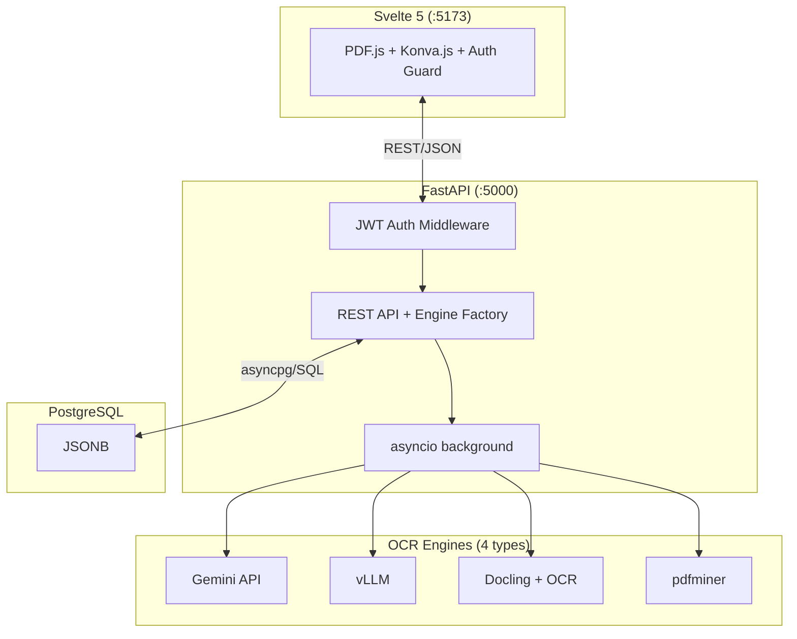

# saegim

Human-in-the-Loop Labeling Platform for Korean Document VLM Benchmarks.

Upload PDF documents to automatically convert them into per-page images,
then label layout elements with bounding boxes, categories, and attributes
in a web-based editor, and export them as standard
[OmniDocBench](https://github.com/opendatalab/OmniDocBench) JSON.

## Architecture



## Key Features

- **PDF Upload & Conversion**: Automatically converts PDFs into high-resolution per-page PNGs
- **Multi-Instance OCR Engines**: Per-project engine registration & management (Gemini API, vLLM, Docling+OCR)
- **Automatic Text/Image Extraction**: Layout + text extraction via OCR engines, reflected in annotations upon acceptance
- **Automatic Attribute Classification**: Automatic classification of page/table/text/formula attributes
- **Canvas Editor**: Bounding box creation/editing/deletion, zoom/panning, keyboard shortcuts
- **Reading Order Editor**: Drag-and-drop reordering + canvas overlay (`O` shortcut)
- **Relation Tool**: Element-to-element relation CRUD + SVG arrow visualization
- **OmniDocBench Labeling**: 15 Block-level + 4 Span-level categories, page/element attribute editing
- **Authentication/Authorization**: JWT-based authentication, system roles (admin/annotator/reviewer)
- **Admin Dashboard**: User/project/system statistics management
- **Project Management**: Project > Document > Page hierarchical structure
- **JSON Export**: Export in OmniDocBench standard format

## Tech Stack

| Layer | Technology |
| ---- | ---- |
| **Frontend** | Svelte 5 (Runes), TypeScript, Vite 7, Tailwind CSS 4, Konva.js, PDF.js |
| **Backend** | Python 3.13+, FastAPI, asyncpg (raw SQL), Pydantic |
| **Authentication** | JWT (access token in-memory + refresh token HttpOnly cookie) + bcrypt |
| **Database** | PostgreSQL 15+ (JSONB) |
| **PDF Processing** | pypdfium2 (2x resolution rendering) + pdfminer.six (automatic text/image extraction) |
| **OCR Engines** | 4-type Strategy pattern (`BaseOCREngine` ABC) |
| **Async Tasks** | asyncio background tasks |
| **Package Management** | Backend: uv / Frontend: Bun |
| **E2E Testing** | Vitest + Docker Compose |

## OCR Engine Architecture

Multiple engine instances can be registered in the per-project `ocr_config` JSONB,
with `default_engine_id` designating the default engine. Multiple engines of the same type can be registered:

| Engine Type | Description | External Service |
| --- | --- | --- |
| `pdfminer` (fallback) | pdfminer.six basic extraction (no GPU required, synchronous) | None |
| `commercial_api` | Gemini full-page VLM analysis | Gemini API |
| `vllm` | vLLM OpenAI-compatible VLM server | vLLM server |
| `split_pipeline` | Docling layout + external OCR | Docling (local) + Gemini/vLLM |

## Project Structure

```text
saegim/
├── saegim-backend/           # FastAPI backend
│   ├── src/saegim/
│   │   ├── api/routes/       # REST endpoints
│   │   ├── schemas/          # Pydantic schemas (EngineType, OcrConfig, etc.)
│   │   ├── services/
│   │   │   ├── engines/      # OCR engine Strategy pattern
│   │   │   │   ├── base.py, factory.py
│   │   │   │   ├── pdfminer_engine.py
│   │   │   │   ├── commercial_api_engine.py
│   │   │   │   ├── vllm_engine.py
│   │   │   │   └── split_pipeline_engine.py
│   │   │   ├── layout_types.py
│   │   │   ├── docling_layout_service.py
│   │   │   ├── gemini_ocr_service.py
│   │   │   ├── vllm_ocr_service.py
│   │   │   └── ocr_pipeline.py
│   │   ├── repositories/     # asyncpg raw SQL
│   │   └── core/             # DB connection pool
│   ├── migrations/           # SQL migrations
│   └── tests/                # pytest tests
│
├── saegim-frontend/          # Svelte 5 SPA (SvelteKit + adapter-static)
│   ├── src/
│   │   ├── routes/           # SvelteKit file-based routes
│   │   └── lib/
│   │       ├── api/          # FastAPI calls + types
│   │       ├── components/   # canvas/, panels/, settings/
│   │       ├── stores/       # Svelte 5 Runes state management (annotation, canvas, pdf, ui)
│   │       ├── types/        # OmniDocBench type definitions + element-groups
│   │       └── utils/        # bbox, color, interaction, text-layout, text-selection
│   └── tests/                # Vitest tests
│
├── e2e/                      # E2E tests
│   ├── docker-compose.e2e.yml
│   ├── tests/                # Basic tests (Vitest)
│   └── tests/gpu/            # GPU-only (vLLM Chandra)
│
└── docker-compose.yml        # Development/deployment
```

## Quick Start

### Docker Compose (Recommended)

```bash
cp .env.example .env
docker compose up -d --build
```

| URL | Description |
| --- | ---- |
| <http://localhost:13000> | Frontend |
| <http://localhost:15000/docs> | Swagger UI |

### Local Development

```bash
# Backend
cd saegim-backend
uv sync --group dev --group docs --extra cpu    # CPU only (or --extra cu128)
uv run uvicorn saegim.app:app --reload --host 0.0.0.0 --port 5000

# Frontend
cd saegim-frontend
bun install
bun run dev
```

## Development

```bash
# Backend
uv run ruff format                  # Formatting
uv run ruff check --fix             # Linting
uv run ty check                     # Type checking
uv run pytest --cov                 # Tests + coverage

# Frontend
bun run check                       # Type checking
bun run test                        # Tests
bun run build                       # Production build

# E2E Tests
cd e2e
bun run docker:up && bun run test   # Basic tests
bun run docker:gpu:up && bun run test:gpu  # GPU tests
```

## Detailed Documentation

| Document | Description |
| ---- | ---- |
| [Architecture Overview](architecture/README.md) | System structure, tech stack, authentication |
| [Backend Architecture](backend/architecture/architecture.md) | Layered architecture, data flow |
| [Frontend Architecture](frontend/architecture/architecture.md) | Component structure, state management |
| [API Guide](backend/guide/api.md) | REST API endpoints (including Auth, Admin) |
| [Multi-User Collaboration](architecture/multi-user-collaboration.md) | Authentication, roles, task workflow |
| [Backend Getting Started](backend/guide/getting-started.md) | Development environment setup |
| [E2E Testing](https://github.com/appleparan/saegim/blob/main/e2e/README.md) | E2E testing guide |
| [Planning Guide](https://github.com/appleparan/saegim/blob/main/AGENTS.md) | Project vision, roadmap |
