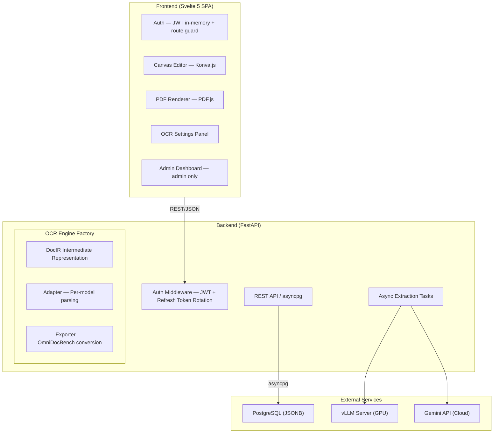

# Architecture Documentation

This document describes the system architecture of saegim, organized by component.

## Overall Structure

## Tech Stack

| Layer | Technology |
| ---- | ---- |
| **Frontend** | Svelte 5 (Runes), TypeScript, Vite 7, Tailwind CSS 4, Konva.js, PDF.js |
| **Backend** | Python 3.13+, FastAPI, asyncpg (raw SQL), Pydantic |
| **Authentication** | JWT (access token in-memory + refresh token HttpOnly cookie) + bcrypt |
| **Database** | PostgreSQL 15+ (JSONB) |
| **PDF Processing** | pypdfium2 (2x resolution rendering) + pdfminer.six (automatic text/image extraction) |
| **OCR Engines** | 4-type Strategy pattern (`BaseOCREngine` ABC) |
| **Async Tasks** | asyncio background tasks |
| **Package Management** | Backend: uv / Frontend: Bun |
| **E2E Testing** | Vitest + Docker Compose |

## Document Index

### Core Pipeline

| Document | Description |
| ---- | ---- |
| [Automatic Extraction Pipeline](extraction-pipeline.md) | OCR engine architecture, per-engine-type flow, `ocr_config` structure |
| [DocIR Architecture](docir-architecture.md) | 3-stage pipeline (Provider-Adapter-Exporter), intermediate representation, model catalog |

### Data & Labeling

| Document | Description |
| ---- | ---- |
| [Data Schema](data-schema.md) | DB tables, JSONB structure, OmniDocBench format |
| [Labeling Workflow](labeling-workflow.md) | Editor UI, canvas layers, keyboard shortcuts |
| [Data Curation](data-curation.md) | Data validation, quality management, export |

### Authentication & Operations

| Document | Description |
| ---- | ---- |
| [Multi-User Collaboration](multi-user-collaboration.md) | JWT authentication, role management, task workflow, admin dashboard |

## Recommended Reading Order

1. To understand the overall flow, start with [Automatic Extraction Pipeline](extraction-pipeline.md).
2. To add or modify OCR models, refer to [DocIR Architecture](docir-architecture.md).
3. To understand the data structure, read [Data Schema](data-schema.md).
4. To modify the labeling UI, read [Labeling Workflow](labeling-workflow.md).
5. To understand the authentication/authorization system, read [Multi-User Collaboration](multi-user-collaboration.md).
