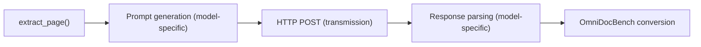
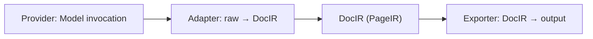
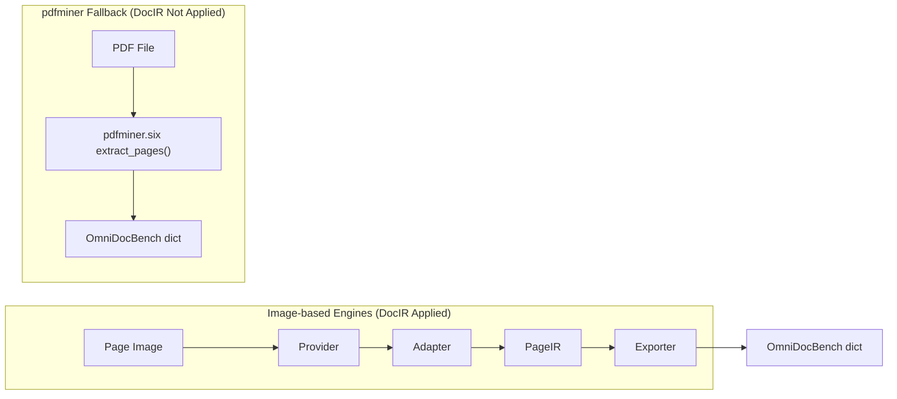
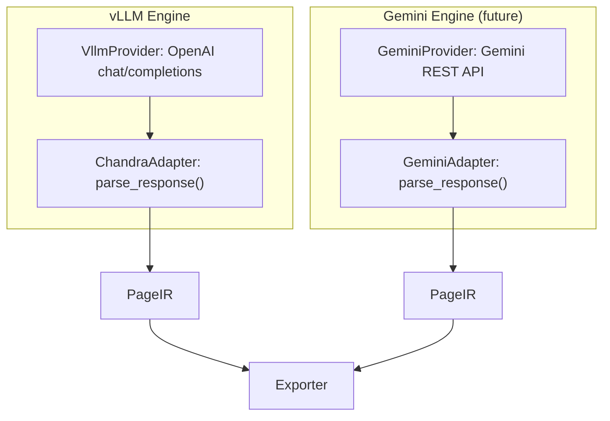
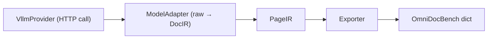
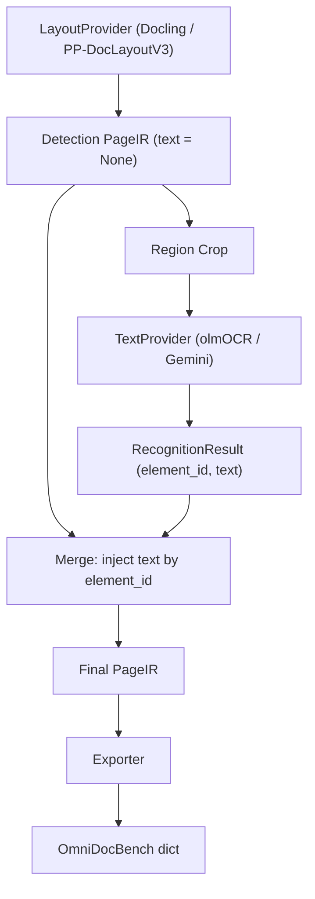
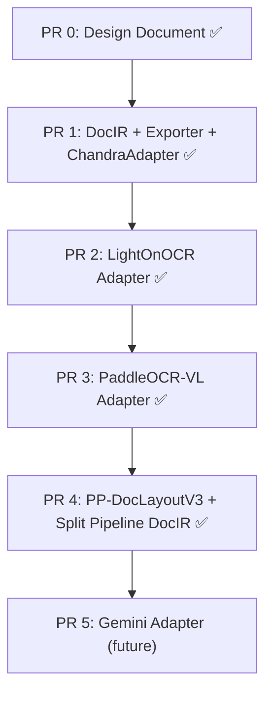

# DocIR Architecture

## 1. Background & Motivation

### Problems with the Current Architecture

Currently, OCR engines handle **model invocation + response parsing + OmniDocBench conversion** within a single class:



Every time a new model is added, the entire Provider class must be rewritten
or branching logic must be added to the existing class.

### Heterogeneity of Model Output Formats

| Model | Output Format |
| ---- | --------- |
| Chandra | JSON array `[{category_type, bbox, text}]` |
| LightOnOCR-bbox-soup | Text + `x1,y1,x2,y2` (coordinates 0-1000) |
| PaddleOCR-VL | Prompt-dependent text (`OCR:`, `Table Recognition:`) |
| PP-DocLayoutV3 | bbox + label + score (no text) |
| Docling | `LayoutRegion(bbox, category, score)` |
| Gemini API | Structured JSON or text |

Handling all formats with a single parser causes complexity to explode.

### Solution Direction

**Separate per-model parsing logic and introduce a common intermediate representation (DocIR).**

## 2. 3-Stage Architecture



### Component Responsibilities

| Component | Responsibility | Prohibited |
| -------- | ---- | ---- |
| **Provider** | HTTP calls or local inference. Returns raw output | No parsing logic |
| **Adapter** | raw output → PageIR conversion. Coordinate normalization, label mapping | No OmniDocBench conversion |
| **Engine** | Orchestration only (provider → adapter → exporter) | No model-specific logic |
| **Exporter** | PageIR → final output (OmniDocBench dict) | No model-specific logic |

### Core Principles

- Model-specific logic exists **only in Adapters**.
- Adding a new model requires writing **only 1 Adapter** (+ optional Provider).
- Engine and Exporter operate independently of the model.

### Scope of Application

The DocIR 3-stage pipeline applies **only to image-based OCR engines**:

| Engine | DocIR Applied | Reason |
| ---- | ---------- | ---- |
| `vllm` | Yes | Image → VLM API → JSON/text |
| `commercial_api` (Gemini) | Yes (future) | Image → Gemini API → JSON |
| `split_pipeline` | Yes | Image → Layout + OCR → synthesis |
| `pdfminer` (fallback) | **No** | Processes PDF files directly, no image needed |

**pdfminer** uses a completely different execution path:



pdfminer's `PdfminerEngine.extract_page()` raises `NotImplementedError`,
and actual extraction is performed synchronously in
`extraction_service.extract_page_elements(pdf_path, page_no)`,
which reads the PDF directly. It is not a target for Adapter conversion.

## 3. DocIR Specification

### PageIR

```python
from dataclasses import dataclass, field
from typing import Any

@dataclass(frozen=True)
class PageIR:
    page_id: str                            # Page identifier
    width_px: int                           # Image width (pixels)
    height_px: int                          # Image height (pixels)
    elements: tuple[ElementIR, ...]         # Immutable element list
    artifacts: dict[str, Any] = field(      # Embedded images, crop regions, etc.
        default_factory=dict,
    )
    meta: dict[str, Any] = field(           # model_name, params, runtime, etc.
        default_factory=dict,
    )
```

**Field descriptions**:

- `elements`: All layout elements detected on the page. Immutability guaranteed with `tuple`.
- `artifacts`: Supplementary data produced by models (e.g., LightOnOCR's embedded images).
- `meta`: Model name, inference parameters, runtime information.
  In debug mode, the original output can be preserved via `meta["raw_model_output"]`.

### ElementIR

```python
from typing import Literal

ElementKind = Literal[
    'text_block', 'title', 'table', 'figure', 'equation',
    'header', 'footer', 'page_number', 'code', 'reference',
    'caption', 'footnote', 'unknown',
]

@dataclass(frozen=True)
class ElementIR:
    id: str                                      # Unique identifier
    kind: ElementKind | str                      # Element type (extensible)
    geometry: Geometry | None = None             # Position information (may be absent)
    text: str | None = None                      # Text content
    reading_order: int | None = None             # Reading order
    scores: dict[str, float] = field(            # Model confidence
        default_factory=dict,
    )
    tags: dict[str, Any] = field(                # Per-model original labels, metadata
        default_factory=dict,
    )
```

**Design decisions**:

- `kind` is a `Literal` + `str` union. Known types are type-safe, while custom labels from new models are also allowed.
- `geometry` is Optional. Supports outputs without geometry such as PaddleOCR-VL.
- `text` is Optional. Supports layout-only models (PP-DocLayoutV3, Docling).
- `scores` is free-form. Used per-model as `{"det": 0.95}`, `{"rec": 0.87}`, etc.
- `tags` preserves original model labels. E.g., `tags["model_label"] = "paragraph_title"`.

### Geometry

```python
@dataclass(frozen=True)
class Geometry:
    bbox: tuple[float, float, float, float] | None = None  # [x1, y1, x2, y2]
    polygon: list[tuple[float, float]] | None = None        # [[x, y], ...]
    rotation: float = 0.0                                    # Rotation angle (degrees)
```

**Coordinate rules**: Adapters always normalize to **pixel coordinates**.
If a model outputs normalized coordinates (0-1000), the Adapter converts them to pixels.

### RecognitionResult (Split Pipeline Only)

```python
@dataclass(frozen=True)
class RecognitionResult:
    element_id: str               # ID of the ElementIR to match
    text: str                     # Extracted text
    category_hint: str            # table → html, equation → latex
    confidence: float | None = None
```

During the merge stage of the split pipeline, `element_id` is used to match
layout ElementIRs and inject text.

## 4. Supported Model Catalog

### 4.1. datalab-to/chandra (vLLM, Full-page OCR)

- **Role**: Full-page OCR (layout + text)
- **Runtime**: vLLM OpenAI-compatible API
- **Input**: STRUCTURED_OCR_PROMPT + base64 image
- **Output**: JSON array `[{category_type, bbox, text, order}]` (pixel coordinates)

**DocIR Mapping**:

| Model Output | DocIR Field |
| --------- | ---------- |
| `category_type` | `ElementIR.kind` |
| `bbox [x1,y1,x2,y2]` | `Geometry.bbox` (pixel, no conversion needed) |
| `text` | `ElementIR.text` |
| `order` | `ElementIR.reading_order` |

**vLLM Serving**:

```bash
vllm serve datalab-to/chandra \
    --gpu-memory-utilization 0.9 \
    --max-num-seqs 4 \
    --max-model-len 32768
```

### 4.2. lightonai/LightOnOCR-2-1B-bbox-soup (vLLM, Full-page OCR)

- **Role**: Full-page OCR (text-centric + image positions)
- **Runtime**: vLLM OpenAI-compatible API
- **Input**: Image only (no prompt)
- **Output**: Text + embedded image bbox

```text
Some document text here.
More text content.
120,50,850,400
Additional text below the image.
```

Coordinates are in the **[0, 1000] normalized** range.

**DocIR Mapping**:

| Model Output | DocIR Field |
| --------- | ---------- |
| Text block | `ElementIR(kind='text_block', geometry=None, text=...)` |
| `![image]` bbox | `ElementIR(kind='figure', geometry=Geometry(bbox=pixel_converted))` |
| Full text | `PageIR.meta['fulltext']` |
| Embedded images | `PageIR.artifacts['embedded_images']` |

**Coordinate conversion**: `x_px = x_norm * page_width / 1000`

**vLLM Serving**:

```bash
vllm serve lightonai/LightOnOCR-2-1B-bbox-soup \
    --limit-mm-per-prompt '{"image": 1}' \
    --mm-processor-cache-gb 0 \
    --no-enable-prefix-caching
```

### 4.3. PaddlePaddle/PaddleOCR-VL (vLLM, Multi-task VLM)

- **Role**: Multi-task VLM (OCR, table recognition, formula recognition)
- **Runtime**: vLLM OpenAI-compatible API
- **Input**: Task prompt (`"OCR:"`, `"Table Recognition:"`) + image
- **Output**: Text (format varies by prompt)

**DocIR Mapping**:

| Model Output | DocIR Field |
| --------- | ---------- |
| Text response | `ElementIR(kind='text_block', geometry=None, text=...)` |
| Structured table | `ElementIR(kind='table', text=...)` |
| Prompt info | `PageIR.meta['prompt']` |

**vLLM Serving**:

```bash
vllm serve PaddlePaddle/PaddleOCR-VL \
    --trust-remote-code \
    --max-num-batched-tokens 16384 \
    --no-enable-prefix-caching \
    --mm-processor-cache-gb 0
```

### 4.4. PaddlePaddle/PP-DocLayoutV3 (Local, Layout Detection)

- **Role**: Layout Detection (bbox + category only, no text)
- **Runtime**: Local PyTorch (HuggingFace transformers, safetensors)
- **Model**: `PaddlePaddle/PP-DocLayoutV3_safetensors`
- **Input**: Image
- **Output**: `[{label, score, box: [x1,y1,x2,y2]}]` (HF transformers `post_process_object_detection()` result)
- **Categories**: 25 types (doc_title, paragraph_title, figure_title, text, content,
  abstract, aside_text, table, image, chart, formula, formula_number,
  header, footer, footnote, vision_footnote, number, reference,
  reference_content, algorithm, seal, toc, figure, table_body, table_caption)
- **Implementation**: `services/pp_doclayout_service.py` (`PPDocLayoutV3Detector`)
- Selected via `split_pipeline` `layout_provider='pp_doclayout'`

**DocIR Mapping**:

| Model Output | DocIR Field |
| --------- | ---------- |
| `label` | `ElementIR.kind` (converted via mapping table) |
| `box` | `Geometry.bbox` (pixel, no conversion needed) |
| `score` | `scores["det"]` |
| Original label | `tags["model_label"]` |

**Label Mapping Table** (implementation: `_LABEL_TO_CATEGORY`):

| PP-DocLayoutV3 label | ElementIR kind |
| -------------------- | -------------- |
| `doc_title` | `title` |
| `paragraph_title` | `title` |
| `figure_title` | `title` |
| `text` | `text_block` |
| `content` | `text_block` |
| `abstract` | `text_block` |
| `aside_text` | `text_block` |
| `table` | `table` |
| `image` | `figure` |
| `chart` | `figure` |
| `formula` | `equation` |
| `formula_number` | `equation` |
| `header` | `header` |
| `footer` | `footer` |
| `footnote` | `footnote` |
| `vision_footnote` | `footnote` |
| `number` | `page_number` |
| `reference` | `reference` |
| `reference_content` | `reference` |
| `algorithm` | `code` |
| Others (seal, toc, etc.) | `unknown` |

### 4.5. ibm-granite/granite-docling-258M (Local, Layout Detection)

- **Role**: Document layout detection (existing implementation)
- **Runtime**: Local PyTorch
- **Input**: Image
- **Output**: `list[LayoutRegion(bbox, category, score, text)]`
- Default layout detector for `split_pipeline`

**DocIR Mapping**: `LayoutRegion` → `ElementIR` direct conversion.
If `LayoutRegion.text` exists, it is included in `ElementIR.text`.

### 4.6. allenai/olmOCR-2-7B-1025 (vLLM, Text Extractor)

- **Role**: Text extraction from cropped images (split_pipeline stage 2)
- **Runtime**: vLLM OpenAI-compatible API
- **Input**: Per-category prompt + cropped image
- **Output**: Text string

**DocIR Mapping**: Converted to `RecognitionResult` and injected into ElementIR during the merge stage.

### 4.7. Gemini API (Cloud, Full-page/Crop OCR)

- **Role**: Full-page OCR or cropped text extraction
- **Runtime**: Google Cloud API
- **Input**: Structured prompt + image
- **Output**: JSON array (same format as Chandra) or text

**DocIR Mapping**: Same as Chandra (JSON → ElementIR).
API parameters are preserved in `PageIR.meta`.

**Adapter Migration Design**:

Gemini uses the **same `STRUCTURED_OCR_PROMPT`** as Chandra and
outputs the same JSON array format. Therefore, `parse_response()` logic can be shared.

However, the API call format differs:

| | vLLM (OpenAI-compatible) | Gemini REST API |
| --- | --- | --- |
| Endpoint | `/v1/chat/completions` | `/v1beta/models/{model}:generateContent` |
| Message format | `messages[{role, content}]` | `contents[{parts[{text, inline_data}]}]` |
| Authentication | None (local) | API key (query param) |

This difference is absorbed at the **Provider layer**:



`GeminiAdapter.parse_response()` only differs in extracting JSON from the Gemini response
(`candidates[0].content.parts[0].text`), while the JSON → PageIR conversion can be shared with ChandraAdapter.
`build_messages()` is implemented separately to match the Gemini REST API format.

> **Migration timing**: After converting the vLLM engine to the Adapter pattern in PRs 1-3,
> CommercialApiEngine (Gemini) will be migrated in a separate PR.

## 5. Pipeline Modes

### 5.1. FullPageEngine

A single model handles layout + text in one pass:



**Applicable models**: Chandra, LightOnOCR, PaddleOCR-VL, Gemini

### 5.2. SplitPipelineEngine

Layout detection and text extraction are separated:



**Applicable models**: Docling + olmOCR, PP-DocLayoutV3 + Gemini, and other combinations

## 6. Component Interfaces

### ModelAdapter Protocol

```python
from typing import Any, Protocol

class ModelAdapter(Protocol):
    """Per-model prompt generation and response parsing."""

    def build_messages(
        self,
        image_b64: str,
        mime_type: str,
        page_width: int,
        page_height: int,
    ) -> list[dict[str, Any]]:
        """Generate messages list in OpenAI chat completions format."""
        ...

    def parse_response(
        self,
        result: dict[str, Any],
        page_width: int,
        page_height: int,
    ) -> PageIR:
        """Convert raw API response → PageIR."""
        ...
```

> **Note**: `build_messages()` returns OpenAI chat completions format.
> Non-OpenAI APIs like Gemini either convert the message format in their own Provider,
> or use a Provider-specific request build method instead of `build_messages()`.

### Adapter Auto-Detection (resolve_adapter)

```python
def resolve_adapter(model_name: str) -> ModelAdapter:
    """Automatically select the appropriate Adapter from the model name."""
    lower = model_name.lower()
    if 'lightonocr' in lower or 'lighton' in lower:
        return LightOnOcrAdapter()
    if 'paddleocr-vl' in lower or 'paddleocr_vl' in lower:
        return PaddleOcrVlAdapter()
    # chandra, olmocr, and other existing models use the default Adapter
    return ChandraAdapter()
```

### OmniDocBench Exporter

```python
def export_page(page: PageIR) -> dict[str, Any]:
    """Convert PageIR → OmniDocBench dict.

    Returns:
        {'layout_dets': [...], 'page_attribute': {}, 'extra': {'relation': []}}
    """
```

### Existing Protocols (Unchanged)

- `LayoutDetector` (`services/layout_types.py`): `detect_layout(image_path) -> list[LayoutRegion]`
- `TextOcrProvider` (`services/ocr_pipeline.py`): `extract_text(image_bytes, category_hint) -> str`

## 7. Guide to Adding New Models

### Adding a Full-page OCR Model

1. **Write Adapter**: `services/adapters/{model_name}.py`
   - Implement `ModelAdapter` Protocol
   - `build_messages()`: Prompt + image format tailored to the model
   - `parse_response()`: raw response → PageIR conversion

2. **Register in resolver**: `services/adapters/resolver.py`
   - Add model name pattern to `resolve_adapter()`

3. **Write tests**: `tests/services/adapters/test_{model_name}.py`
   - `build_messages()` format validation
   - `parse_response()` normal/edge cases
   - `resolve_adapter()` pattern matching

4. **Update documentation**: Add to the model catalog (Section 4) in this file

### Adding a Layout Detection Model (Split Pipeline)

1. **Write Detector**: `services/{model_name}_service.py`
   - Implement `LayoutDetector` Protocol

2. **Integrate with SplitPipelineEngine**: Add to layout_provider options

3. **Label mapping table**: Model category → ElementIR kind mapping

## 8. File Structure

```text
saegim-backend/src/saegim/services/
├── docir.py                     # PageIR, ElementIR, Geometry, RecognitionResult
├── adapters/
│   ├── __init__.py
│   ├── base.py                  # ModelAdapter Protocol
│   ├── resolver.py              # resolve_adapter(model_name)
│   ├── chandra.py               # ChandraAdapter
│   ├── lightonocr.py            # LightOnOcrAdapter
│   └── paddleocr_vl.py          # PaddleOcrVlAdapter
├── exporters/
│   ├── __init__.py
│   └── omnidocbench.py          # export_page(PageIR) → dict
├── engines/
│   ├── base.py                  # BaseOCREngine (unchanged)
│   ├── vllm_engine.py           # VllmEngine (adapter injection)
│   ├── split_pipeline_engine.py # SplitPipelineEngine (DocIR-based)
│   ├── commercial_api_engine.py # CommercialApiEngine (future migration)
│   ├── pdfminer_engine.py       # PdfminerEngine (DocIR not applied, unchanged)
│   └── factory.py               # Engine factory
├── vllm_ocr_service.py          # VllmOcrProvider (uses adapter)
├── gemini_ocr_service.py        # GeminiOcrProvider (future adapter conversion)
├── pp_doclayout_service.py      # PP-DocLayoutV3 detector
├── docling_layout_service.py    # Docling detector (existing)
├── extraction_service.py        # pdfminer fallback (direct PDF processing, independent of DocIR)
├── ocr_provider.py              # deprecated wrapper maintained
└── ...
```

## 9. Migration Plan

### PR Order and Dependencies



### Completed PR Summary

| PR | Content | Key Files |
| --- | --- | --- |
| PR 0 | DocIR design document (this file) | `docs/architecture/docir-architecture.md` |
| PR 1 | DocIR types + OmniDocBench Exporter + ChandraAdapter + VllmEngine integration | `docir.py`, `adapters/chandra.py`, `exporters/omnidocbench.py`, `vllm_engine.py` |
| PR 2 | LightOnOcrAdapter (0-1000 normalized coordinate conversion, embedded image parsing) | `adapters/lightonocr.py`, `adapters/resolver.py` |
| PR 3 | PaddleOcrVlAdapter (task prompt-based multi-task VLM) | `adapters/paddleocr_vl.py` |
| PR 4 | PPDocLayoutV3Detector + SplitPipelineEngine `layout_provider` option | `pp_doclayout_service.py`, `split_pipeline_engine.py`, `factory.py` |

### Future Work

- **Gemini Adapter**: Convert `CommercialApiEngine` to DocIR Adapter pattern.
  JSON parsing logic can be shared with ChandraAdapter, with API format differences absorbed at the Provider layer.

### Backward Compatibility Strategy

- `engine_type='vllm'` is maintained. Existing configurations work as-is.
- `resolve_adapter()` automatically selects the Adapter by model name,
  so existing `datalab-to/chandra` configurations use `ChandraAdapter`.
- The existing `build_omnidocbench_page()` is maintained as a deprecated wrapper,
  internally calling the Exporter.
- Public API (`extract_page() → dict`) is unchanged.
- pdfminer fallback maintains its existing path independently of DocIR.
- Gemini (`CommercialApiEngine`) will be converted in a separate PR after vLLM migration is complete.
