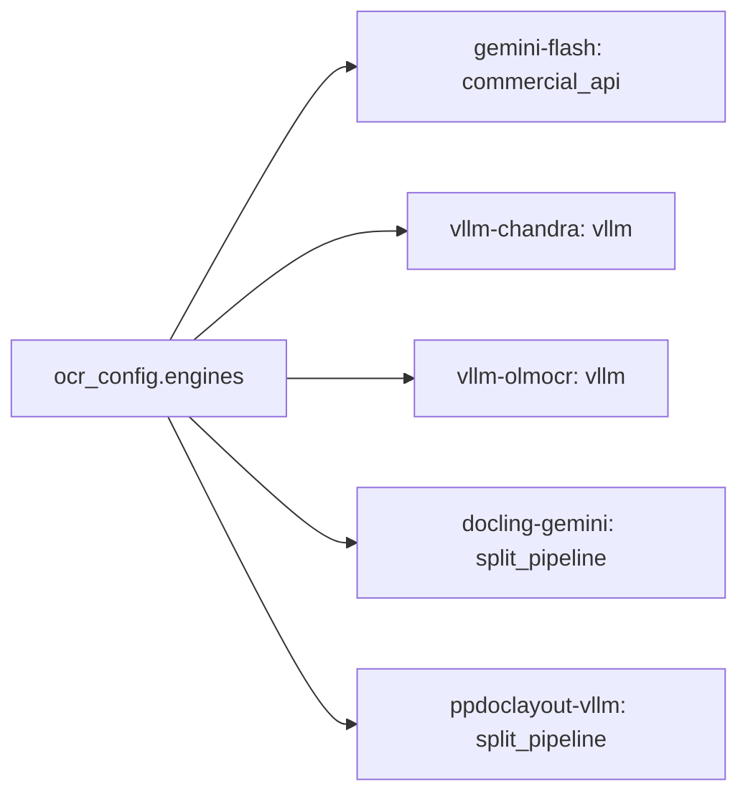
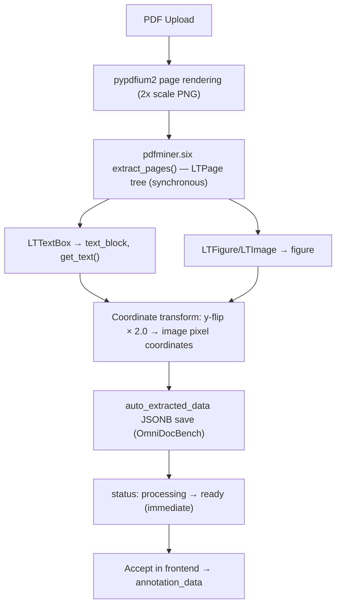
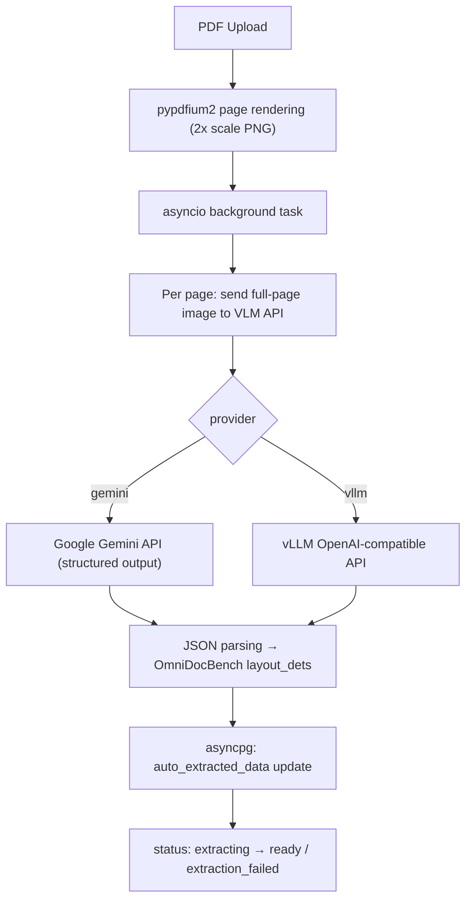
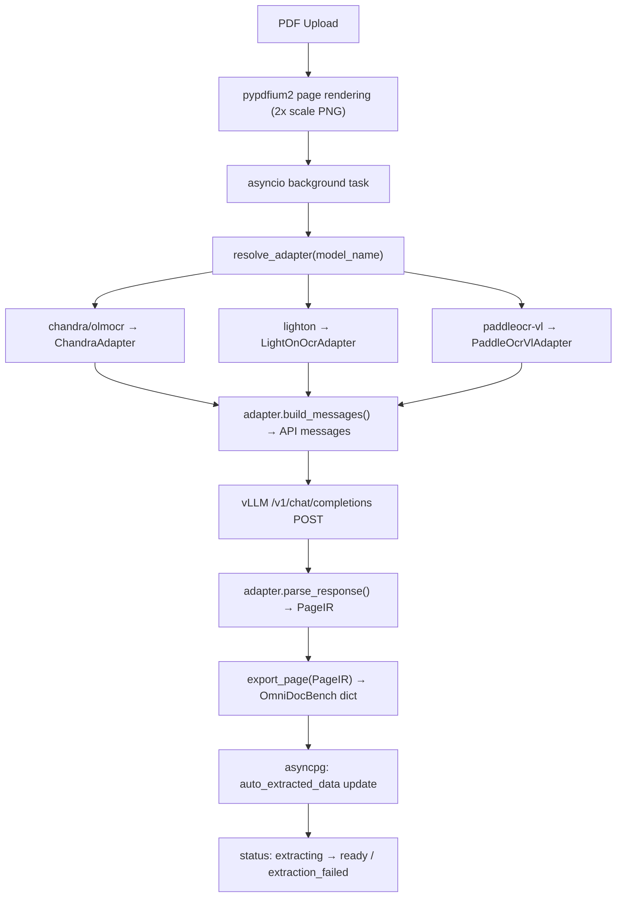
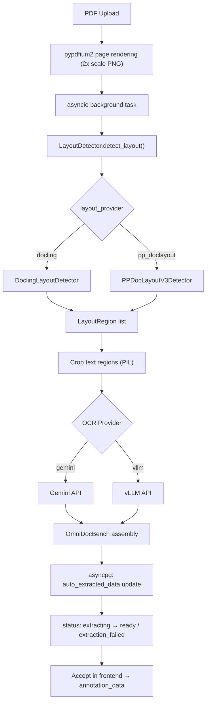
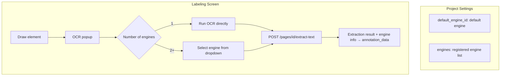
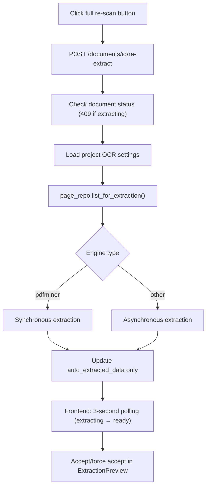

# Automatic Extraction Pipeline

> **Note**: For the per-model parsing architecture (Provider-Adapter-Exporter 3-stage pipeline) and
> intermediate representation (DocIR) specification, refer to [DocIR Architecture](docir-architecture.md).

## Multi-Instance OCR Engine Architecture

Multiple engine instances can be registered in the per-project `ocr_config` JSONB,
with `default_engine_id` designating the default engine.
Using a Strategy pattern via `BaseOCREngine` ABC, three registrable engine types are supported:



`pdfminer` is an always-available fallback engine that is automatically used when `default_engine_id` is null, without requiring registration.

| Engine Type | Description | External Service | Use Case |
| --- | --- | --- | --- |
| `pdfminer` (fallback) | pdfminer.six basic extraction | None | CI/testing/environments without GPU |
| `commercial_api` | Commercial VLM API (Gemini) | Gemini API | High-quality full-page OCR |
| `vllm` | vLLM OpenAI-compatible VLM server | vLLM server | Local GPU-based OCR |
| `split_pipeline` | Split pipeline (Layout + OCR) | Docling or PP-DocLayoutV3 (local) + Gemini/vLLM | Layout detection + VLM OCR combination |

## pdfminer.six Fallback (`engine_type: pdfminer`)



## Commercial API Engine (`engine_type: commercial_api`)



## vLLM Engine (`engine_type: vllm`)

Full-page OCR via vLLM OpenAI-compatible API.
DocIR 3-stage pipeline (Provider → Adapter → Exporter) applied:



## Split Pipeline Engine (`engine_type: split_pipeline`)

Combination of layout detection + external OCR (Gemini/vLLM).
The layout detection backend is selected via the `layout_provider` setting:

| layout_provider | Model | Characteristics |
| --- | --- | --- |
| `docling` (default) | ibm-granite/granite-docling-258M | DocTags XML parsing, may include text |
| `pp_doclayout` | PaddlePaddle/PP-DocLayoutV3_safetensors | 25 categories, pixel bbox, no text |



## Per-Element Engine Override

All engine instances registered in the project can be selected from the labeling screen.



## `ocr_config` JSONB Structure

```json
{
  "default_engine_id": "gemini-flash",
  "engines": {
    "gemini-flash": {
      "engine_type": "commercial_api",
      "name": "Gemini Flash",
      "config": { "provider": "gemini", "api_key": "...", "model": "gemini-3-flash-preview", "prompt": "" }
    },
    "vllm-chandra": {
      "engine_type": "vllm",
      "name": "vLLM Chandra",
      "config": { "host": "gpu-server-1", "port": 8000, "model": "datalab-to/chandra" }
    },
    "vllm-olmocr": {
      "engine_type": "vllm",
      "name": "vLLM olmOCR",
      "config": { "host": "gpu-server-2", "port": 8000, "model": "allenai/olmOCR-2-7B-1025-FP8" }
    },
    "ppdoclayout-vllm": {
      "engine_type": "split_pipeline",
      "name": "PP-DocLayoutV3 + vLLM",
      "config": {
        "layout_provider": "pp_doclayout",
        "ocr_provider": "vllm",
        "ocr_host": "gpu-server-1",
        "ocr_port": 8000,
        "ocr_model": "allenai/olmOCR-2-7B-1025-FP8"
      }
    }
  }
}
```

When `default_engine_id` is null, pdfminer fallback is used. Legacy format is automatically converted by `normalize_ocr_config()`.

## Implementation Files

### DocIR 3-Stage Pipeline (`services/`)

> Detailed design: [DocIR Architecture](docir-architecture.md)

- `services/docir.py`: DocIR intermediate representation (`PageIR`, `ElementIR`, `Geometry`, `RecognitionResult`)
- `services/adapters/base.py`: `ModelAdapter` Protocol (`build_messages()`, `parse_response()`)
- `services/adapters/resolver.py`: `resolve_adapter(model_name)` — automatic Adapter selection by model name
- `services/adapters/chandra.py`: `ChandraAdapter` (Chandra, olmOCR, and other STRUCTURED_OCR_PROMPT models)
- `services/adapters/lightonocr.py`: `LightOnOcrAdapter` (LightOnOCR, 0-1000 normalized coordinates)
- `services/adapters/paddleocr_vl.py`: `PaddleOcrVlAdapter` (PaddleOCR-VL, task prompt-based)
- `services/exporters/omnidocbench.py`: `export_page(PageIR)` → OmniDocBench dict conversion

### Engine Abstraction (`services/engines/`)

- `services/engines/base.py`: `BaseOCREngine` ABC (`extract_page()`, `test_connection()`)
- `services/engines/factory.py`: `build_engine_by_id(ocr_config, engine_id)` factory (multi-instance support)
- `services/engines/pdfminer_engine.py`: `PdfminerEngine`
- `services/engines/commercial_api_engine.py`: `CommercialApiEngine` (Gemini/vLLM full-page)
- `services/engines/vllm_engine.py`: `VllmEngine` (DocIR Adapter pattern applied, `resolve_adapter()` auto-detection)
- `services/engines/split_pipeline_engine.py`: `SplitPipelineEngine` (layout detection + external OCR, `layout_provider` selection)

### Sub-services

- `services/layout_types.py`: `LayoutRegion` dataclass, `LayoutDetector` Protocol
- `services/docling_layout_service.py`: `DoclingLayoutDetector` (ibm-granite/granite-docling-258M)
- `services/pp_doclayout_service.py`: `PPDocLayoutV3Detector` (PaddlePaddle/PP-DocLayoutV3_safetensors)
- `services/ocr_pipeline.py`: 2-stage pipeline orchestrator (`OcrPipeline`, `TextOcrProvider` Protocol)
- `services/ocr_provider.py`: Prompt constants (`STRUCTURED_OCR_PROMPT`, `get_text_prompt()`)
- `services/gemini_ocr_service.py`: `GeminiOcrProvider`, `GeminiTextOcrProvider`
- `services/vllm_ocr_service.py`: `VllmOcrProvider`, `VllmTextOcrProvider`
- `services/ocr_connection_test.py`: Individual connection tests (`check_gemini_connection`, `check_vllm_connection`, `check_docling_connection`)
- `services/extraction_service.py`: pdfminer.six fallback extraction

### Integration

- `services/document_service.py`: asyncio background tasks (`build_engine_by_id()` → `asyncio.to_thread(engine.extract_page())`)
- `schemas/project.py`: `EngineInstance`, `EngineInstanceCreate`, `OcrConfigResponse`, `AvailableEngine`
- `services/text_extraction_service.py`: `build_text_provider(ocr_config, engine_id)` per-element engine override
- `OcrSettingsPanel.svelte`: Engine instance card-based management UI (add/edit/delete/set default)

## Re-extraction

After changing the OCR engine, existing documents can be re-extracted with the new engine.



**Force accept**: When re-extracting with existing annotations,
`POST /pages/{id}/force-accept-extraction` can replace existing annotations with new extraction results.
Unlike the regular `accept-extraction`, it does not check whether `annotation_data` is empty.

## Candidate Tool Comparison

| Tool | Characteristics | Advantages | Disadvantages | Status |
| ------ | ------ | ------ | ------ | ------ |
| **MinerU** (OpenDataLab) | Tool by OmniDocBench team (AGPL) | Direct compatibility with OmniDocBench format, 15+ categories | AGPL license | **Removed** (license issues) |
| **PP-StructureV3** (PaddlePaddle) | Layout+OCR+table integration | High accuracy (OmniDocBench Overall 86.73) | Paddle dependency (Docker service) | **Removed** (replaced by Docling) |
| **DocLayout-YOLO** | Lightweight layout detection | Fast inference speed | Separate text recognition needed | Not implemented |
| **Marker** (VikParuchuri) | PDF → Markdown conversion | Simple pipeline | No attribute information | Not implemented |
| **Google Gemini API** | VLM structured output | High-quality OCR, cloud API | API cost, network dependency | **Implemented** (per-project settings) |
| **vLLM (local)** | OpenAI-compatible VLM server | Local execution, no cost | GPU required, model management | **Implemented** (per-project settings) |

## Automatic Attribute Classification Strategy

| Attribute | Automatic Classification Method | Expected Accuracy |
| ------ | -------------- | ----------- |
| data_source | Metadata + image classification model (ResNet, etc.) | Medium-High |
| language | Text language detection (langdetect, etc.) | High |
| layout | Column analysis algorithm (X-coordinate clustering) | High |
| watermark | Image analysis (transparent text detection) | Medium |
| fuzzy_scan | Image sharpness measurement (Laplacian variance) | High |
| colorful_background | Image color histogram analysis | High |
| table attributes | Automatic extraction via table structure analysis | Medium-High |
| text attributes | OCR + text analysis combination | Medium |
| formula attributes | Based on formula recognition results | Medium |
