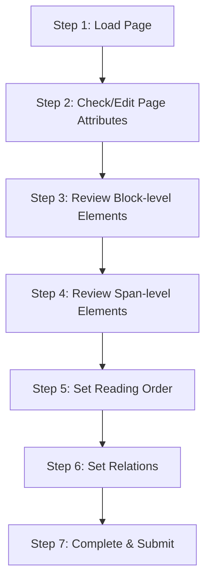

# Labeling UI Workflow

## Annotator Workflow

Details for each step:

1. **Load Page**: View image with auto-extracted results overlaid as bboxes
2. **Page Attributes**: Select data_source, language, layout, watermark, etc. from dropdowns
3. **Block-level Review**:
   - Check/change category_type, adjust bbox position/size
   - Assign per-category attribute labels (text_block → text_language, etc.)
   - Review text/latex/html content, toggle ignore
   - OCR engine selection popup when drawing new elements
4. **Span-level Review**: Edit line_with_spans within blocks
5. **Reading Order**: Drag-and-drop reordering or direct number input
6. **Relation Setup**: figure-caption, table-caption/footnote, truncated relations
7. **Submit**: Confirm automatic validation passes, then submit

## Core UI Feature Requirements

| Feature | Description | Priority |
| ------ | ------ | --------- |
| Image zoom/panning | Freely zoom in/out on high-resolution documents | P0 |
| Bbox create/edit/delete | Rectangle drawing, vertex dragging, deletion | P0 |
| Category selection | Dropdown or shortcut key assignment | P0 |
| Attribute panel | Dynamically displayed attribute inputs based on category | P0 |
| Text editing panel | Inline editing of text / latex / html | P0 |
| Reading order editor | Number overlay display + order modification | P1 |
| Relation linking | Select two elements to assign relation labels | P1 |
| Keyboard shortcuts | Quick category switching, next/previous element navigation | P1 |
| Undo/Redo | Undo all editing operations | P1 |
| Auto-save | Periodic auto-save (prevent work loss) | P1 |
| ~~Minimap~~ | ~~Show current position in thumbnail page overview~~ | ~~P2~~ (no implementation planned) |
| ~~Comparison view~~ | ~~Side-by-side original image vs labeling result~~ | ~~P2~~ (no implementation planned) |
