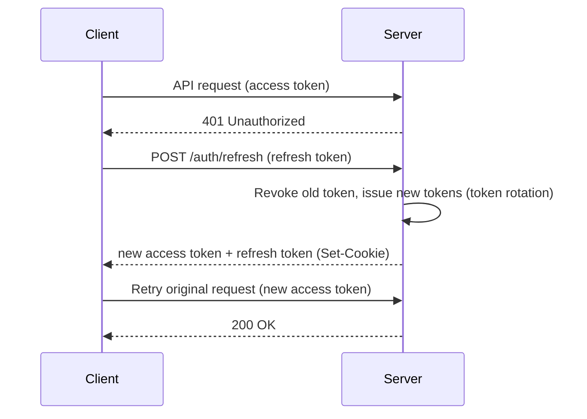
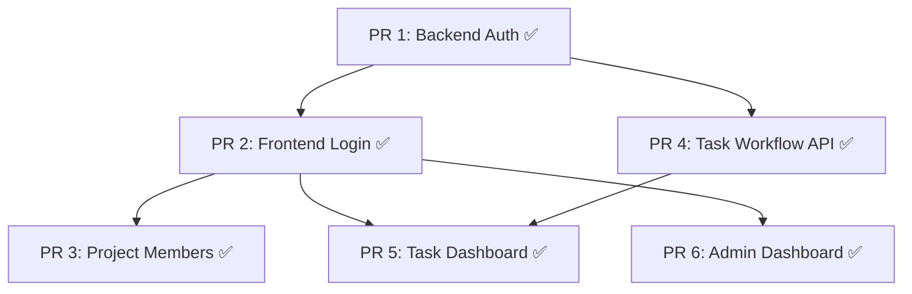
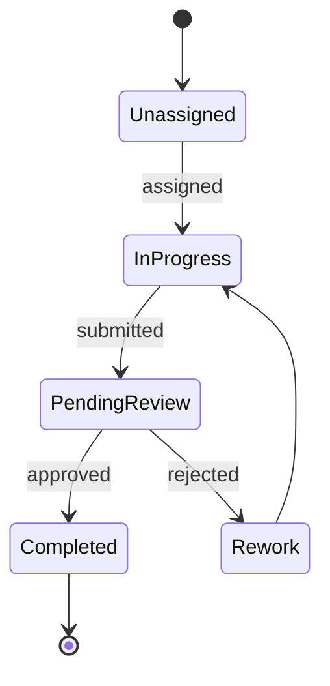

# Multi-User Collaboration

## Current Status

### Implemented

- **JWT Authentication**: access token (in-memory) + refresh token (HttpOnly cookie)
  - Token rotation with family-based theft detection
  - Grace period for multi-tab support
  - bcrypt 12 rounds password hashing
  - First user → admin role automatically granted
- **Frontend Authentication**: Login/signup pages, auth guard, proactive token refresh (1-minute interval)
- **Admin Dashboard**: User management, project statistics, system status
- **Existing Route Protection**: `get_current_user` auth middleware applied to all API endpoints
- **Project Member Management**: `project_members` table CRUD, membership-based project access control
- **Task Workflow API**: Assignment/submission/approval/rejection, `locked_at` 30-minute timeout concurrent editing prevention
- **Frontend Task UI**: Task dashboard (`/tasks`), review queue (`/projects/[id]/review`), status badges
- **Progress Board**: Project-wide progress, per-document/per-member status (`/projects/[id]/progress`)

## Goal

Move beyond a shared interface to build an environment where multiple users
share projects and divide labeling work with role-based task assignment and review.

## Role System (2 Layers)

System-level and project-level roles are separated.

### System Roles (`users.role`)

| Role | Permissions |
| ---- | ---- |
| `admin` | Full user management (CRUD, role changes, deactivation), access to all projects, system settings |
| `annotator` | Perform work within assigned projects |
| `reviewer` | Perform reviews within assigned projects |

### Project Roles (`project_members.role`)

| Role | Permissions |
| ---- | ---- |
| `owner` | Change project settings, manage members, assign tasks |
| `annotator` | Label assigned pages |
| `reviewer` | Review submitted pages (approve/reject) |

**Admin can access all projects without being in project_members** (system-level override).

### First User = Admin

- During registration, if the `users` table has 0 records, `role = 'admin'` is automatically assigned
- Subsequent registrants get the default `role = 'annotator'`
- Only admin can change other users' system roles

## Authentication Architecture

### Token Strategy

| Token | Storage Location | Expiration | Purpose |
| ---- | --------- | --------- | ---- |
| Access Token | Memory (JavaScript variable) | 15 minutes | API request authentication |
| Refresh Token | HttpOnly Secure SameSite cookie | 7 days | Access Token renewal |

### Token Renewal Flow

### Theft Detection (Family-based)

- Each refresh token belongs to a `family_id` (new family created on login)
- On token rotation, `revoked_at` is recorded on the previous token
- If an already-revoked token is reused → check grace period
  - Within grace period: normal (multi-tab support)
  - Beyond grace period: entire family revoked (theft detected)

### Password Management

- bcrypt 12 rounds (OWASP recommended)
- `must_change_password` flag: activated when admin resets password
- Password change invalidates all sessions (refresh token hard delete)

### Auth API

| Method | Path | Auth | Description |
| ------ | ---- | ---- | ---- |
| `GET` | `/api/v1/auth/check-login-id` | Not required | Check login ID availability |
| `POST` | `/api/v1/auth/register` | Not required | Registration (first user → admin) |
| `POST` | `/api/v1/auth/login` | Not required | Login (JWT issuance) |
| `POST` | `/api/v1/auth/refresh` | Not required | Renew access token via refresh token |
| `POST` | `/api/v1/auth/logout` | Not required | Revoke refresh token family |
| `PATCH` | `/api/v1/auth/me/credentials` | Required | Change login ID/email/password |

### Admin API

| Method | Path | Auth | Description |
| ------ | ---- | ---- | ---- |
| `GET` | `/api/v1/admin/users` | admin | Full user list |
| `PATCH` | `/api/v1/admin/users/:id` | admin | Change user role / deactivate |
| `GET` | `/api/v1/admin/projects` | admin | Full project list (with statistics) |
| `GET` | `/api/v1/admin/stats` | admin | System statistics |

### Frontend Authentication

- **AuthStore** (`auth.svelte.ts`): Svelte 5 runes-based, token in-memory, JWT payload derived
- **HTTP Client** (`client.ts`): Automatic Bearer token injection, 401 silent refresh → retry
- **Proactive Refresh**: Automatic renewal 2 minutes before access token expiry (1-minute interval check)
- **Route Guard** (`+layout.svelte`): Unauthenticated → `/login`, `must_change_password` → `/account/security`

## Implementation Stages (PR Breakdown)

### Dependencies

### PR 1: Backend Auth Foundation ✅

**Branch**: `feat/auth-backend` | **PR**: #88

- JWT authentication (access token + refresh token rotation)
- Added `password_hash`, `login_id`, `is_active`, `must_change_password` to `users` table
- `refresh_tokens` table (family-based theft detection)
- `project_members` table schema (N:M relationship)
- Auth routes: register, login, refresh, logout, check-login-id, credentials update
- Admin routes: users list/update, projects list, system stats
- `get_current_user`, `require_admin`, `require_project_member` dependencies
- Auth middleware applied to existing routes

### PR 2: Frontend Login + Auth Guard ✅

**Branch**: `feat/auth-frontend` | **PR**: #95

- JWT decoding utility (`jwt.ts`)
- AuthStore (token in-memory, derived user/role/mustChangePassword)
- HTTP client: automatic Bearer header injection, 401 silent refresh, proactive refresh
- Login/registration pages (Korean UI, shadcn-svelte)
- Route guard (`+layout.svelte`): unauthenticated redirect, 1-minute interval expiry check
- Admin-only `/admin` link in header
- Backend 687 tests, frontend 202 tests passing

### PR 3: Project Member Management ✅

**Branch**: `feat/project-members` | **PR**: #92

- `repositories/project_member_repo.py`: CRUD
- `GET/POST/PATCH/DELETE /projects/:id/members`
- Membership check on project access (`require_project_member`)
- Creator → owner auto-registration on project creation
- Frontend: member management tab in `/projects/[id]/settings`
- Backend 747 tests, frontend 221 tests, E2E 10 API tests passing

### PR 4: Task Workflow API ✅

**Branch**: `feat/task-workflow` | **PR**: #87

- `repositories/task_repo.py`: Assignment/submission/review logic
- `POST /pages/:id/assign`, `POST /pages/:id/submit`, `POST /pages/:id/review`
- `locked_at` management (30-minute timeout auto-release)
- `GET /users/me/tasks`, `GET /projects/:id/review-queue`
- Automatic `task_history` recording
- 721 tests passing, 84.13% coverage

### PR 5: Task Dashboard + Review Queue UI ✅

**Branch**: `feat/task-dashboard` | **PR**: #91

- `/tasks` page: my assignment list, status filters, progress
- `/projects/[id]/review` page: reviewer-only review queue
- Status badges, locked indicators, submit button in labeling UI

### PR 6: Admin Dashboard ✅

**Branch**: `feat/admin-dashboard` | **PR**: #102

- `/admin` page (tab structure): user management, project management, system status
- Admin route guard (non-admin → `/` redirect)
- `src/lib/api/admin.ts`: admin API call module
- `GET /api/v1/admin/stats` system statistics endpoint
- Backend 772 tests, frontend 245 tests passing

## Task Workflow

### Workflow

### Concurrent Editing Prevention

Uses the existing `pages.locked_at`:

- When page editing starts: `locked_at = NOW()`, `assigned_to = current_user`
- If another user attempts access, "editing in progress" is displayed
- Auto-release after timeout (e.g., 30 minutes)

## Frontend Collaboration UI

### Implemented

| Component | Description | Access Permission |
| -------- | ---- | -------- |
| Login page (`/login`) | Login ID/password authentication | Public |
| Registration page (`/register`) | User registration | Public |
| Admin dashboard (`/admin`) | User/project/system management | admin |
| Project member management (`/projects/[id]/settings`) | Invite, change roles, remove | owner / admin |
| Task dashboard (`/tasks`) | My assignment list, status filters, progress | Authenticated users |
| Review queue (`/projects/[id]/review`) | Reviewer-only, approve/reject UI | reviewer / admin |
| Progress board (`/projects/[id]/progress`) | Project-wide progress, per-document/per-member status | Members |

## Risks

| Risk | Mitigation |
| ------ | ---- |
| Authentication security vulnerabilities | bcrypt + JWT standard implementation, OWASP checklist |
| Concurrent editing conflicts | Optimistic locking + timeout auto-release |
| Role permission complexity growth | Middleware-based RBAC, limited to 3 system + 3 project roles |
| Admin account compromise | Additional admin creation restricted after initial admin, password strength validation |
| Refresh token theft | Family-based theft detection + token rotation |

## Prerequisites

- Phase 2 (automatic extraction) basic completion ✅
- `users`, `task_history` tables already exist ✅
