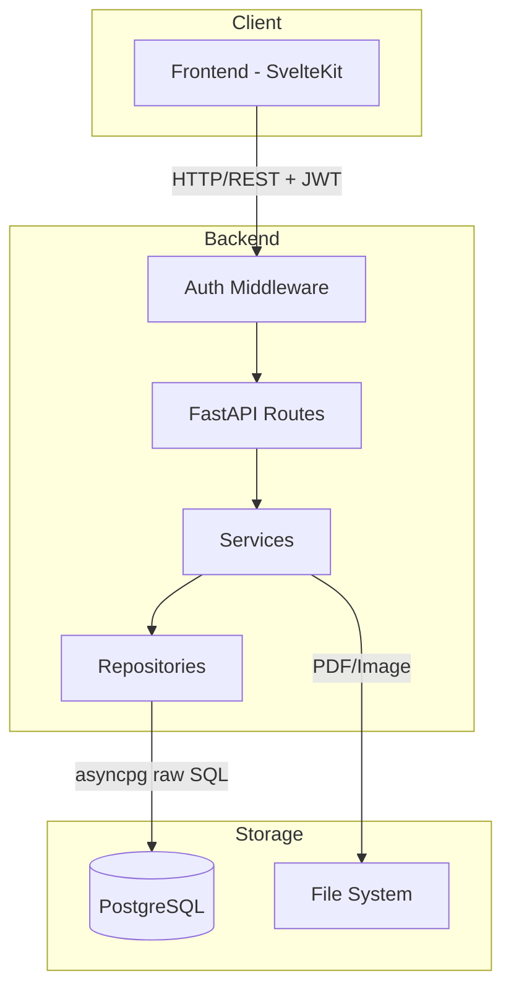
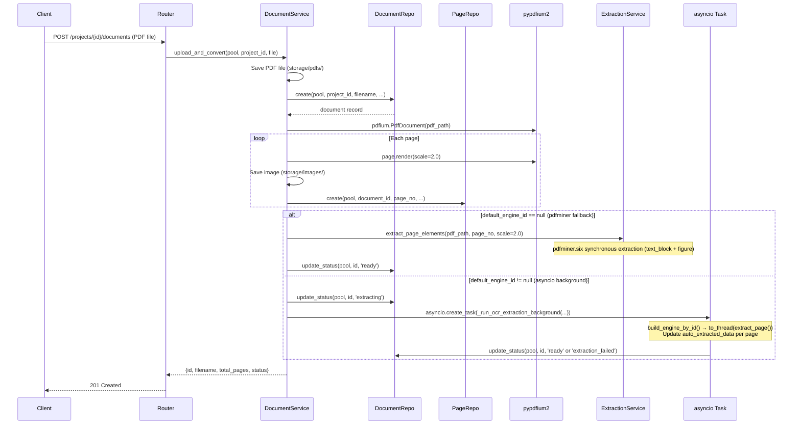
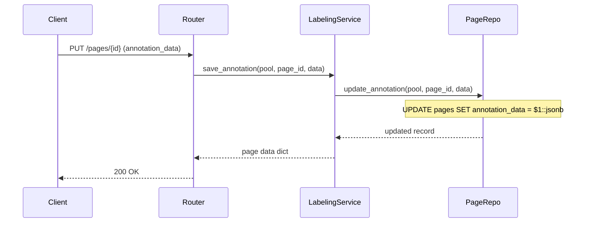
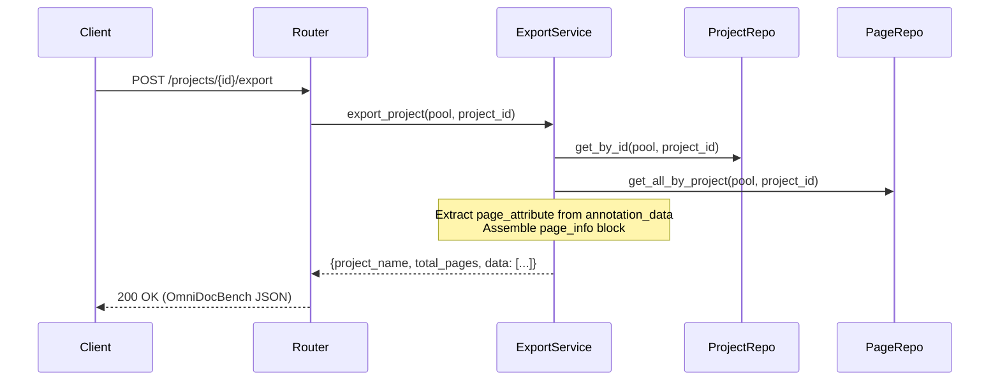
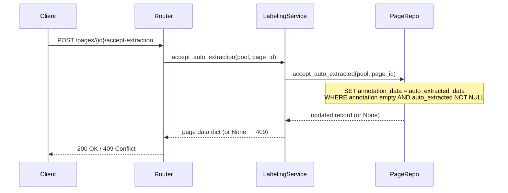
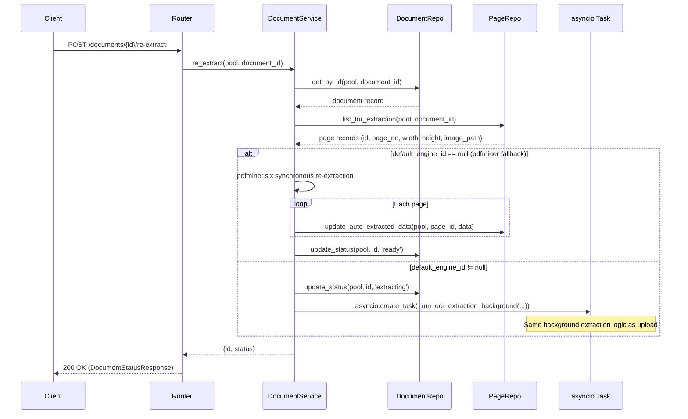
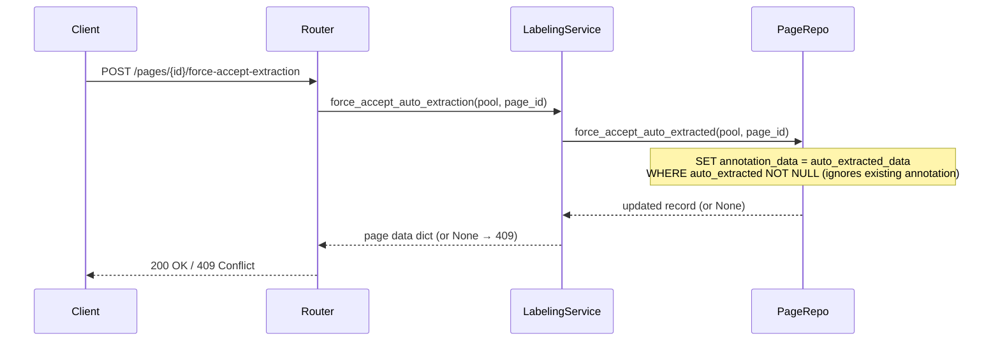
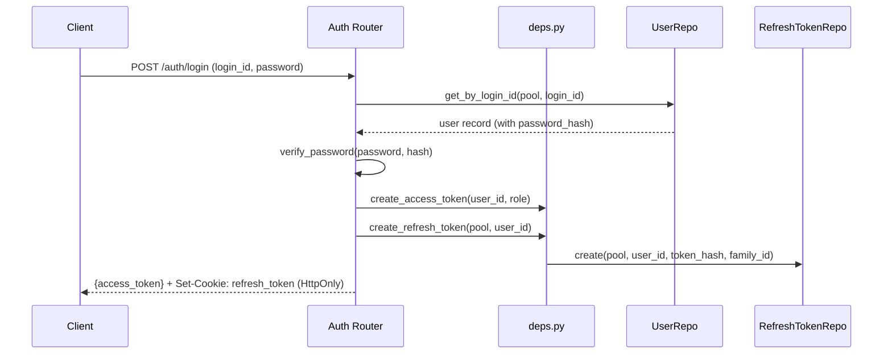
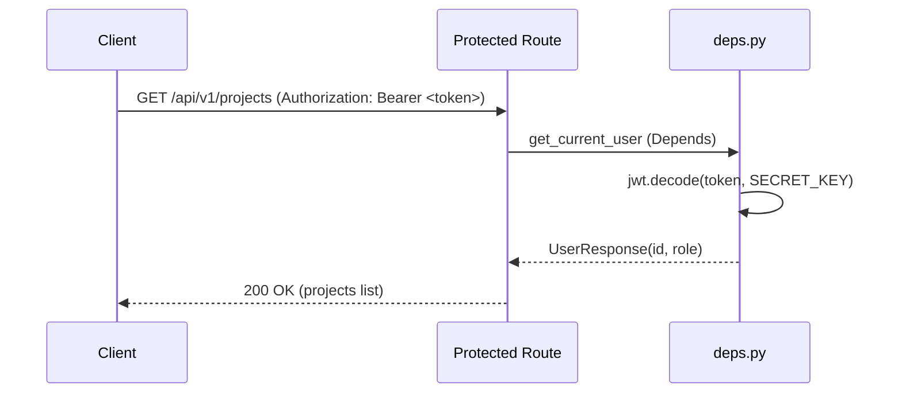

# Architecture

## System Structure



## Layered Architecture

The saegim backend follows a 3-tier architecture:

### Routes (API Router)

Receives HTTP requests, calls the appropriate service, and returns responses.

```text
src/saegim/api/
├── deps.py         # Auth/authz dependency (get_current_user, require_admin, require_project_member)
└── routes/
    ├── health.py       # GET /api/v1/health, /health/ready
    ├── auth.py         # Registration, login, token refresh, logout, credentials change
    ├── admin.py        # User/project/system stats management (admin only)
    ├── projects.py     # Project CRUD, OCR engine instance CRUD, default engine configuration
    ├── documents.py    # Document upload/view/delete/re-extract
    ├── pages.py        # Page labeling, reading order, relation CRUD, force accept, per-element text extraction
    ├── users.py        # User management
    └── export.py       # OmniDocBench JSON export
```

- Uses FastAPI's `APIRouter`
- Request/response validation with Pydantic schemas
- All endpoints use the `/api/v1` prefix
- Protected endpoints verify JWT via `get_current_user` dependency

### Authentication/Authorization (deps.py)

Auth-related FastAPI Depends are defined in `api/deps.py`:

- `get_current_user`: Decodes JWT from Bearer token, extracts user_id/role
- `require_admin`: Verifies `role == 'admin'` (403 Forbidden)
- `require_project_member`: Checks project membership or admin status
- `create_access_token` / `create_refresh_token`: JWT/refresh token generation
- `rotate_refresh_token`: Token rotation (revoke previous token + issue new token)
- `validate_refresh_token`: Grace period-based theft detection

### Services (Business Logic)

Handles core business logic.

```text
src/saegim/services/
├── engines/                       # OCR Engine Strategy Pattern
│   ├── base.py                    # BaseOCREngine ABC (extract_page, test_connection)
│   ├── factory.py                 # build_engine_by_id(ocr_config, engine_id) factory (multi-instance)
│   ├── pdfminer_engine.py          # PdfminerEngine (GPU-free fallback)
│   ├── commercial_api_engine.py   # CommercialApiEngine (Gemini/vLLM full-page)
│   ├── vllm_engine.py             # VllmEngine (DocIR Adapter pattern, resolve_adapter() auto-detection)
│   └── split_pipeline_engine.py   # SplitPipelineEngine (layout detection + external OCR, layout_provider selection)
├── docir.py                       # DocIR intermediate representation (PageIR, ElementIR, Geometry, RecognitionResult)
├── adapters/                      # Model-specific Adapters (raw → DocIR conversion)
│   ├── base.py                    # ModelAdapter Protocol (build_messages, parse_response)
│   ├── resolver.py                # resolve_adapter(model_name) — auto-select Adapter by model name
│   ├── chandra.py                 # ChandraAdapter (Chandra, olmOCR, etc. — STRUCTURED_OCR_PROMPT family)
│   ├── lightonocr.py              # LightOnOcrAdapter (LightOnOCR, 0-1000 normalized coordinates)
│   └── paddleocr_vl.py            # PaddleOcrVlAdapter (PaddleOCR-VL, task prompt-based)
├── exporters/                     # DocIR → final output conversion
│   └── omnidocbench.py            # export_page(PageIR) → OmniDocBench dict
├── document_service.py            # PDF upload → image conversion → extraction branching (pdfminer/asyncio), re-extraction (re_extract)
├── extraction_service.py          # pdfminer.six fallback extraction (text_block + figure)
├── layout_types.py                # LayoutRegion dataclass, LayoutDetector Protocol
├── docling_layout_service.py      # DoclingLayoutDetector (ibm-granite/granite-docling-258M)
├── pp_doclayout_service.py        # PPDocLayoutV3Detector (PaddlePaddle/PP-DocLayoutV3_safetensors)
├── ocr_pipeline.py                # 2-stage pipeline orchestrator (OcrPipeline, TextOcrProvider)
├── ocr_provider.py                # Prompt constants, bbox_to_poly(), build_omnidocbench_page()
├── gemini_ocr_service.py          # GeminiOcrProvider, GeminiTextOcrProvider
├── vllm_ocr_service.py            # VllmOcrProvider, VllmTextOcrProvider
├── ocr_connection_test.py         # check_gemini/vllm/docling_connection()
├── labeling_service.py            # Annotation CRUD, element add/delete, auto-extraction accept/force-accept, reading order update, relation CRUD
├── attribute_classifier.py        # Page/table/text/formula attribute auto-classification
└── export_service.py              # OmniDocBench JSON assembly
```

- Calls repositories for data access
- Handles file system I/O (PDF storage, image conversion)
- Handles JSON string/dict parsing for JSONB data

### Repositories (Data Access)

Executes raw SQL against PostgreSQL using asyncpg.

```text
src/saegim/repositories/
├── project_repo.py         # INSERT/SELECT projects
├── document_repo.py        # INSERT/SELECT/UPDATE documents
├── page_repo.py            # JSONB operations (jsonb_set, jsonb_agg), relation CRUD (add_relation, delete_relation)
├── user_repo.py            # User CRUD, password hash management, login_id/email uniqueness checks
├── refresh_token_repo.py   # Refresh token CRUD, family-based rotation, theft detection
└── admin_repo.py           # System stats, project stats (admin only)
```

- All functions take `asyncpg.Pool` as the first argument
- SQL parameters use `$1`, `$2`, etc. positional binding
- Returns `asyncpg.Record` objects

## Data Flow

### PDF Upload Flow



### Annotation Save Flow



### Export Flow



### Auto-Extraction Accept Flow



### Document Re-Extraction Flow



### Force Accept Flow



### Authentication Flow





## Connection Pool Management

The asyncpg connection pool is managed via FastAPI lifespan:

```python
@asynccontextmanager
async def lifespan(app: FastAPI) -> AsyncIterator[None]:
    settings = app.state.settings
    await create_pool(
        settings.database_url,
        min_size=settings.db_pool_min_size,  # default: 2
        max_size=settings.db_pool_max_size,  # default: 10
    )
    yield
    await close_pool()
```

- Pool is created at app startup and released at shutdown
- Module-level pool access via `get_pool()` function
- Repository functions receive the pool as an argument to acquire connections

## Static File Serving

Page images are served via FastAPI `StaticFiles`:

```text
/storage/images/{document_id}_p{page_no}.png
```

The `storage/images/` directory is mounted at the `/storage/images` path.

## Core Component Design

### A. PDF Ingestion Service

- Converts PDF pages to high-resolution images (200 DPI or higher)
- Stores the original PDF and converted images
- Auto-generates page_info (page_no, height, width, image_path)

### B. Auto-Extraction Pipeline

- Layout Detection: Extracts bounding box + category_type for block/span elements on each page
- OCR Engine: Fills the text field of text blocks
- Table Recognizer: Generates html/latex fields for table elements
- Formula Recognizer: Generates latex fields for formula elements
- Attribute Classifier: Auto-classifies page/block attributes
- Reading Order Estimator: Auto-assigns order fields
- All extraction results are saved as "draft JSON" and passed to the human review stage

Details: [Extraction Pipeline](../../architecture/extraction-pipeline.md)

### C. Labeling Web Interface (Core)

- **3-layer Hybrid Viewer** (HybridViewer):
  - Layer 1: PDF.js `<canvas>` vector rendering (fallback: `` raster image)
  - Layer 2: Konva.js canvas (image block bbox + selected element)
  - Layer 3: DOM TextOverlay (text blocks -- image fallback mode only)
- **Icon-based compact toolbar**: Select(1)/Draw(2)/Pan(3) + zoom percentage display
- Side panel: Edit category, attribute, text/latex/html of the selected element
- PageNavigator: Navigate pages in multi-page documents with `Q`/`E` keys or arrows
- ExtractionPreview: Display OCR extraction status + accept/dismiss results

Details: [Labeling Workflow](../../architecture/labeling-workflow.md)

### D. Quality Assurance Module

- Auto-validation rules (bbox within image bounds, required attribute checks, etc.)
- Cross-validation: 2+ people independently label the same page, then review discrepancies
- Progress dashboard

### E. Export Service

- Serialization to OmniDocBench JSON format
- Packaging with image files
- Optionally exports in a format compatible with KO-VLM-Benchmark evaluation scripts
