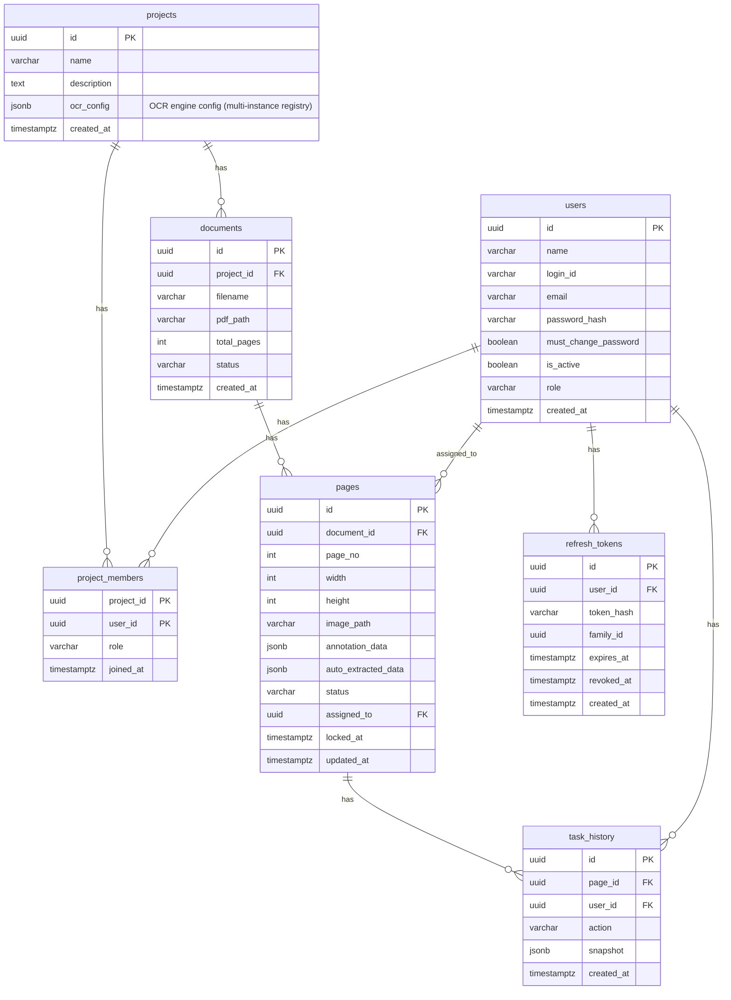

# Database

## Overview

saegim uses PostgreSQL and executes raw SQL directly via asyncpg.
It leverages pure SQL and JSONB without an ORM.

## Why PostgreSQL

This project is a "web app with 2-5 concurrent users," so SQLite is not suitable.

| Requirement | SQLite | PostgreSQL |
| --------- | -------- | ------------ |
| Concurrent writes by multiple users | Single writer lock, causes conflicts | Safe concurrent writes |
| JSON field search/indexing | TEXT storage, slow search | JSONB indexes, fast queries |
| Partial JSON updates | Full replacement | Partial updates with jsonb_set() |
| Setup complexity | Single file | One-line setup with Docker Compose |

Labeling work involves frequent auto-saves, so concurrent write safety is essential.

## Page-Level JSONB Storage Strategy

There are two options for storing labeling data:

- **Strategy A (Normalized)**: Separate layout_elements, span_elements, and relations tables
  -- Complex JOINs required, needs OmniDocBench JSON conversion logic
- **Strategy B (Page-Level JSONB)**: Store everything in a single annotation_data JSONB column in the pages table
  -- Store and retrieve OmniDocBench JSON structure as-is

**Strategy B is adopted.** Reasons:

1. Almost no conversion logic needed between OmniDocBench JSON and DB (store and retrieve for direct export)
2. Schema extensions are simple (adding JSON fields requires no DB migration)
3. PostgreSQL JSONB supports internal field indexing, enabling queries like "find only table categories"
4. With thousands of pages at 10-50KB per page, the total is only tens to hundreds of MB

## Data Storage Location Separation

| Storage Target | Location | Reason |
| ----------- | ------ | ------ |
| Original PDF | File system `./storage/pdfs/` | Binary, never modified |
| Page images | File system `./storage/images/` | Large size, read-only |
| Labeling JSON | PostgreSQL JSONB (`pages.annotation_data`) | Concurrent editing safe, queryable/indexable |
| Auto-extraction original | PostgreSQL JSONB (`pages.auto_extracted_data`) | Kept for comparison/restoration |
| Project/document/user metadata | PostgreSQL regular columns | Relational data |
| Final export files | File system (generated then downloaded) | OmniDocBench JSON + image package |

## ER Diagram



## Table Details

### projects

Manages documents at the project level.

| Column | Type | Default | Description |
| ------ | ------ | -------- | ------ |
| `id` | UUID PK | `uuid_generate_v4()` | Project ID |
| `name` | VARCHAR(255) | - | Project name |
| `description` | TEXT | `''` | Project description |
| `ocr_config` | JSONB | `NULL` | OCR engine config (multi-instance: default_engine_id + engines dict) |
| `created_at` | TIMESTAMPTZ | `NOW()` | Created at |

### documents

Stores PDF document information.

| Column | Type | Default | Description |
| ------ | ------ | -------- | ------ |
| `id` | UUID PK | `uuid_generate_v4()` | Document ID |
| `project_id` | UUID FK | - | Parent project |
| `filename` | VARCHAR(512) | - | Original filename |
| `pdf_path` | VARCHAR(1024) | - | PDF storage path |
| `total_pages` | INT | `0` | Total page count |
| `status` | VARCHAR(20) | `'uploading'` | Document status |
| `created_at` | TIMESTAMPTZ | `NOW()` | Created at |

**status values:**

| Value | Description |
| ---- | ------ |
| `uploading` | Uploading |
| `processing` | Converting to images |
| `extracting` | OCR extraction in progress (asyncio background) |
| `ready` | Conversion/extraction complete, ready for labeling |
| `error` | Conversion failed |
| `extraction_failed` | OCR extraction failed |

**Indexes:**

- `idx_documents_project_id` - `project_id` (per-project lookup)

### pages

Stores per-page annotation data. This is the core table.

| Column | Type | Default | Description |
| ------ | ------ | -------- | ------ |
| `id` | UUID PK | `uuid_generate_v4()` | Page ID |
| `document_id` | UUID FK | - | Parent document |
| `page_no` | INT | - | Page number (starting from 1) |
| `width` | INT | `0` | Image width (px) |
| `height` | INT | `0` | Image height (px) |
| `image_path` | VARCHAR(1024) | `''` | Image path |
| `annotation_data` | JSONB | `'{}'` | OmniDocBench annotation |
| `auto_extracted_data` | JSONB | `NULL` | Auto-extraction results |
| `status` | VARCHAR(20) | `'pending'` | Labeling status |
| `assigned_to` | UUID FK | `NULL` | Assigned user |
| `locked_at` | TIMESTAMPTZ | `NULL` | Lock timestamp |
| `updated_at` | TIMESTAMPTZ | `NOW()` | Last modified |

**status values:**

| Value | Description |
| ---- | ------ |
| `pending` | Unassigned/not started |
| `in_progress` | Labeling in progress |
| `submitted` | Submitted |
| `reviewed` | Review complete |

**Indexes:**

- `idx_pages_document_id` - `document_id` (per-document lookup)
- `idx_pages_status` - `status` (status filtering)
- `idx_pages_assigned_to` - `assigned_to` (per-user assignment lookup)
- `idx_pages_annotation` - `annotation_data` GIN (JSONB search)

### users

Stores user information.

| Column | Type | Default | Description |
| ------ | ------ | -------- | ------ |
| `id` | UUID PK | `uuid_generate_v4()` | User ID |
| `name` | VARCHAR(255) | - | Name |
| `login_id` | VARCHAR(64) UNIQUE | - | Login ID |
| `email` | VARCHAR(255) UNIQUE | - | Email |
| `password_hash` | VARCHAR(255) | `NULL` | bcrypt password hash |
| `must_change_password` | BOOLEAN | `FALSE` | Force password change on first login |
| `is_active` | BOOLEAN | `TRUE` | Account active status |
| `role` | VARCHAR(20) | `'annotator'` | Role |
| `created_at` | TIMESTAMPTZ | `NOW()` | Created at |

**role values:** `admin`, `annotator`, `reviewer`

### task_history

Tracks task history.

| Column | Type | Default | Description |
| ------ | ------ | -------- | ------ |
| `id` | UUID PK | `uuid_generate_v4()` | History ID |
| `page_id` | UUID FK | - | Target page |
| `user_id` | UUID FK | - | Acting user |
| `action` | VARCHAR(20) | - | Action type |
| `snapshot` | JSONB | `NULL` | Point-in-time snapshot |
| `created_at` | TIMESTAMPTZ | `NOW()` | Occurred at |

**action values:** `assigned`, `started`, `saved`, `submitted`, `approved`, `rejected`

**Indexes:**

- `idx_task_history_page_id` - `page_id` (per-page history lookup)
- `idx_task_history_user_id` - `user_id` (per-user history lookup)

### project_members

Manages the N:M relationship between projects and users.

| Column | Type | Default | Description |
| ------ | ------ | -------- | ------ |
| `project_id` | UUID PK, FK | - | Parent project |
| `user_id` | UUID PK, FK | - | Member user |
| `role` | VARCHAR(20) | `'annotator'` | Role within the project |
| `joined_at` | TIMESTAMPTZ | `NOW()` | Joined at |

**PK:** `(project_id, user_id)` composite key

**role values:** `owner`, `annotator`, `reviewer`

**Indexes:**

- `idx_project_members_user_id` - `user_id` (per-user project lookup)

### refresh_tokens

Manages JWT refresh tokens. Supports family-based token rotation and theft detection.

| Column | Type | Default | Description |
| ------ | ------ | -------- | ------ |
| `id` | UUID PK | `uuid_generate_v4()` | Token ID |
| `user_id` | UUID FK | - | Token owner |
| `token_hash` | VARCHAR(128) UNIQUE | - | SHA-256 token hash |
| `family_id` | UUID | - | Token family ID (rotation tracking) |
| `expires_at` | TIMESTAMPTZ | - | Expiration time |
| `revoked_at` | TIMESTAMPTZ | `NULL` | Revocation time (soft revocation) |
| `created_at` | TIMESTAMPTZ | `NOW()` | Created at |

**Indexes:**

- `idx_refresh_tokens_user_id` - `user_id` (per-user token lookup)
- `idx_refresh_tokens_token_hash` - `token_hash` (token verification)
- `idx_refresh_tokens_family_id` - `family_id` (family-level revocation)

## annotation_data JSONB Structure

The JSON inside the `pages.annotation_data` column is essentially one page of OmniDocBench data.
During export, collecting this column into an array directly produces the final JSON.

```jsonc
{
  "layout_dets": [
    {
      "category_type": "text_block",
      "poly": [x1,y1, x2,y2, x3,y3, x4,y4],
      "ignore": false, "order": 0, "anno_id": 0,
      "text": "...", "latex": "...", "html": "...",
      "attribute": { /* per-category attributes */ },
      "line_with_spans": [ /* Span-level sub-elements */ ]
    }
  ],
  "page_attribute": {
    "data_source": "academic_literature", "language": "ko",
    "layout": "double_column",
    "watermark": false, "fuzzy_scan": false, "colorful_background": false
  },
  "extra": {
    "relation": [{ "source_anno_id": 3, "target_anno_id": 4, "relation_type": "parent_son" }]
  }
}
```

Type definitions: [saegim-frontend/src/lib/types/omnidocbench.ts](https://github.com/appleparan/saegim/blob/main/saegim-frontend/src/lib/types/omnidocbench.ts)

Schema details: [Data Schema](../../architecture/data-schema.md)

## Export Logic

Implementation: `saegim-backend/src/saegim/services/export_service.py`

Since annotation_data is stored in OmniDocBench structure,
export is essentially just **retrieving from DB and attaching page_info**.

## JSONB Operations

### Full annotation_data Update

```sql
UPDATE pages
SET annotation_data = $1::jsonb, updated_at = NOW()
WHERE id = $2
```

### Partial page_attribute Update

Uses `jsonb_set` to replace only `page_attribute` inside `annotation_data`:

```sql
UPDATE pages
SET annotation_data = jsonb_set(
    COALESCE(annotation_data, '{}'::jsonb),
    '{page_attribute}',
    $1::jsonb
), updated_at = NOW()
WHERE id = $2
```

### Appending Elements to layout_dets

Appends a new element to the existing array using the `||` operator:

```sql
UPDATE pages
SET annotation_data = jsonb_set(
    COALESCE(annotation_data, '{"layout_dets": []}'::jsonb),
    '{layout_dets}',
    COALESCE(annotation_data->'layout_dets', '[]'::jsonb) || $1::jsonb
), updated_at = NOW()
WHERE id = $2
```

### Deleting Elements from layout_dets

Uses `jsonb_agg` and `jsonb_array_elements` to filter out elements where `anno_id` matches:

```sql
UPDATE pages
SET annotation_data = jsonb_set(
    annotation_data,
    '{layout_dets}',
    (
        SELECT COALESCE(jsonb_agg(elem), '[]'::jsonb)
        FROM jsonb_array_elements(annotation_data->'layout_dets') AS elem
        WHERE (elem->>'anno_id')::int != $1
    )
), updated_at = NOW()
WHERE id = $2
```

### Accepting auto_extracted_data (Copying to annotation_data)

Copies `auto_extracted_data` to `annotation_data`.
Only works when existing annotation is empty:

```sql
UPDATE pages
SET annotation_data = auto_extracted_data, updated_at = NOW()
WHERE id = $1
  AND auto_extracted_data IS NOT NULL
  AND (
    annotation_data IS NULL
    OR annotation_data = '{}'::jsonb
    OR NOT (annotation_data ? 'layout_dets')
    OR jsonb_array_length(COALESCE(annotation_data->'layout_dets', '[]'::jsonb)) = 0
  )
RETURNING ...
```

If `annotation_data.layout_dets` already has elements, the update is skipped and `NULL` is returned
(handled as 409 Conflict at the API level).

## Migrations

Managed manually with SQL files:

```text
migrations/
└── 001_init.sql  # Full schema (projects, users, documents, pages, task_history, project_members, refresh_tokens)
```

How to run:

```bash
# Run directly with psql
psql -U labeling -d labeling -f migrations/001_init.sql
```

Programmatic execution (`database.run_migrations`):

```python
from saegim.core.database import run_migrations

await run_migrations(pool, migrations_dir='migrations')
```

This function sorts `.sql` files in the `migrations/` directory by name and executes them sequentially.
