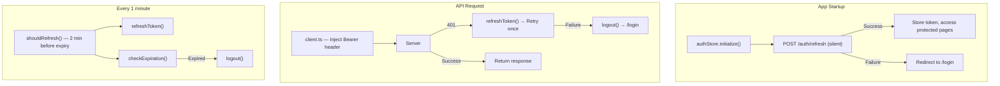
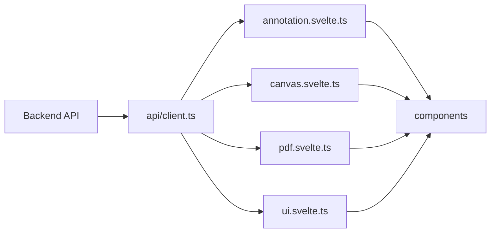

# Saegim Frontend Architecture

## Overview

The Saegim frontend is a labeling web application for Korean document VLM benchmarks.
It allows editing annotation data in OmniDocBench JSON format on a Canvas
and saving it to a FastAPI backend.

## Tech Stack

| Area | Technology | Version |
| ------ | ------ | ------ |
| UI Framework | Svelte 5 (runes) | ^5.43 |
| Build Tool | SvelteKit (Vite-based) + adapter-static | ^2.21 |
| Styling | Tailwind CSS 4 + shadcn-svelte (bits-ui) | ^4.1 |
| Theme | Violet theme (OKLCH CSS variables) + dark mode (mode-watcher) | - |
| Canvas | Konva.js | ^10.2 |
| PDF Rendering | pdfjs-dist (PDF.js) | ^5.4 |
| Router | SvelteKit file-based routing | - |
| Test | Vitest + jsdom | ^4.0 |
| Package Manager | Bun | - |

## Directory Structure

```text
src/
├── app.html                # SvelteKit HTML template
├── app.css                 # Tailwind + shadcn theme CSS variables (violet OKLCH) + category colors
├── routes/                 # SvelteKit file-based routes
│   ├── +layout.svelte          # Global layout + Auth Guard + ModeWatcher
│   ├── +layout.ts              # ssr=false, prerender=false
│   ├── +page.svelte            # / (project list)
│   ├── login/+page.svelte      # /login (sign in)
│   ├── register/+page.svelte   # /register (sign up)
│   ├── admin/+page.svelte      # /admin (admin dashboard, admin only)
│   ├── account/
│   │   └── security/+page.svelte  # /account/security (change password)
│   ├── projects/[id]/
│   │   ├── +page.svelte        # /projects/:id (document list)
│   │   └── settings/+page.svelte  # /projects/:id/settings (OCR settings)
│   └── label/[pageId]/
│       └── +page.svelte        # /label/:pageId (labeling)
├── lib/
│   ├── types/              # Type definitions
│   │   ├── omnidocbench.ts     # AnnotationData, LayoutElement, Poly, etc.
│   │   ├── categories.ts      # 18 block categories, attribute enums, Korean labels
│   │   ├── canvas.ts          # Point, Rect, ToolMode, ViewportState
│   │   └── element-groups.ts  # IMAGE/TEXT_BLOCK_CATEGORIES, block classification helpers
│   ├── utils/              # Pure functions
│   │   ├── bbox.ts             # Coordinate conversion (poly <-> rect, screen <-> image)
│   │   ├── color.ts            # Colors by category
│   │   ├── interaction.ts     # Interaction mode interpretation, pointer event calculation
│   │   ├── jwt.ts             # JWT decoding (client-side), expiration check
│   │   ├── text-layout.ts     # Text block layout calculation
│   │   ├── text-selection.ts  # Text selection/copy utilities
│   │   └── validation.ts      # Annotation validation
│   ├── api/                # HTTP client
│   │   ├── client.ts           # fetch wrapper + automatic Bearer injection + 401 silent refresh
│   │   ├── types.ts            # API request/response types
│   │   ├── auth.ts             # Login/registration/token refresh/logout API
│   │   ├── admin.ts            # Admin API (users/projects/stats)
│   │   ├── projects.ts
│   │   ├── documents.ts
│   │   ├── pages.ts
│   │   ├── elements.ts
│   │   └── relations.ts
│   ├── stores/             # Svelte 5 runes state management
│   │   ├── auth.svelte.ts        # Auth state (token, user, role, mustChangePassword)
│   │   ├── annotation.svelte.ts  # Annotation data + CRUD
│   │   ├── canvas.svelte.ts      # Viewport (zoom/pan/tool)
│   │   ├── pdf.svelte.ts         # PDF.js document loading/caching
│   │   └── ui.svelte.ts          # Sidebar, notifications, panel tabs (including relations)
│   └── components/
│       ├── ui/            # shadcn-svelte (button, badge, card, dialog, ...)
│       ├── common/         # Reusable UI widgets (LoadingSpinner, Select)
│       ├── layout/         # Header, Sidebar (4 tabs), ThemeToggle
│       ├── canvas/         # 3-layer viewer + overlays (HybridViewer, BboxLayer, etc.)
│       ├── panels/         # Sidebar panels (ElementList, AttributePanel, ExtractionPreview, etc.)
│       ├── settings/       # Project settings (OcrSettingsPanel)
│       └── admin/          # Admin dashboard panels (AdminUsersPanel, AdminProjectsPanel, AdminStatsPanel)
└── tests/
    ├── lib/utils/bbox.test.ts
    ├── lib/utils/interaction.test.ts
    ├── lib/utils/text-layout.test.ts
    ├── lib/utils/text-selection.test.ts
    ├── lib/stores/canvas.test.ts
    ├── lib/stores/pdf.test.ts
    ├── lib/types/element-groups.test.ts
    ├── lib/components/canvas/HybridViewer.test.ts
    ├── lib/components/canvas/TextOverlay.test.ts
    ├── lib/components/panels/PageNavigator.test.ts
    ├── lib/components/panels/ExtractionPreview.test.ts
    └── lib/components/settings/OcrSettingsPanel.test.ts
```

## Routing

SvelteKit file-based routing (`adapter-static` SPA mode):

| Path | Route File | Auth | Description |
| ---- | ---------- | ---- | ---- |
| `/login` | `routes/login/+page.svelte` | Public | Sign in |
| `/register` | `routes/register/+page.svelte` | Public | Sign up |
| `/` | `routes/+page.svelte` | Required | Project list + creation |
| `/projects/[id]` | `routes/projects/[id]/+page.svelte` | Required | Document list + PDF upload |
| `/projects/[id]/settings` | `routes/projects/[id]/settings/+page.svelte` | Required | OCR engine settings |
| `/label/[pageId]` | `routes/label/[pageId]/+page.svelte` | Required | 3-panel labeling screen |
| `/admin` | `routes/admin/+page.svelte` | Admin | Admin dashboard |
| `/account/security` | `routes/account/security/+page.svelte` | Required | Change password |

## Data Flow

### Authentication Flow



### Labeling Flow



1. On page load, call `getPage()` API
2. Store the response data via `annotationStore.load()`
3. If `pdf_url` is present, `pdfStore.loadDocument()` renders the PDF as vectors via PDF.js
4. `$derived` properties automatically compute elements, selectedElement, etc.
5. HybridViewer renders with a 3-layer structure (background PDF/image -> Konva bbox -> TextOverlay)
6. User edits -> store update -> `isDirty = true`
7. Save button -> `savePage()` API call -> `markSaved()`

## Key Patterns

### Immutability

All state updates create new objects (spread operator):

```typescript
// annotationStore.updateElement()
this.annotationData = {
  ...this.annotationData,
  layout_dets: this.annotationData.layout_dets.map((el) =>
    el.anno_id === annoId ? { ...el, ...updates } : el,
  ),
}
```

### Class-based Stores with Runes

Uses Svelte 5's `$state` and `$derived` as class fields:

```typescript
class AnnotationStore {
  annotationData = $state<AnnotationData | null>(null)
  elements = $derived(this.annotationData?.layout_dets ?? [])
}
export const annotationStore = new AnnotationStore()
```

### AuthStore (Authentication State Management)

Authentication state is managed by the `AuthStore` class. The access token is stored in memory only (to prevent XSS):

```typescript
class AuthStore {
  token = $state<string | null>(null)          // in-memory only
  isInitialized = $state(false)
  payload = $derived(/* JWT decode */)         // user_id, role, exp
  user = $derived<AuthUser | null>(/* ... */)  // id, name, role
  isAuthenticated = $derived(/* ... */)
  isAdmin = $derived(/* role === 'admin' */)
  mustChangePassword = $derived(/* ... */)
}
```

### Canvas + Store Sync

Konva.js objects are synchronized with store state inside `$effect`:

```typescript
$effect(() => {
  const _elements = annotationStore.elements
  syncRects(_elements)  // Create/update/delete Konva Rects
})
```

## Environment Variables

| Variable | Default | Description |
| ------ | -------- | ------ |
| `VITE_API_URL` | `http://localhost:8000` | Backend API URL |

## Scripts

```bash
bun run dev         # Development server (localhost:5173)
bun run build       # Production build
bun run preview     # Preview build output
bun run check       # TypeScript type check
bun run test        # Run Vitest tests
bun run test:watch  # Vitest watch mode
```
