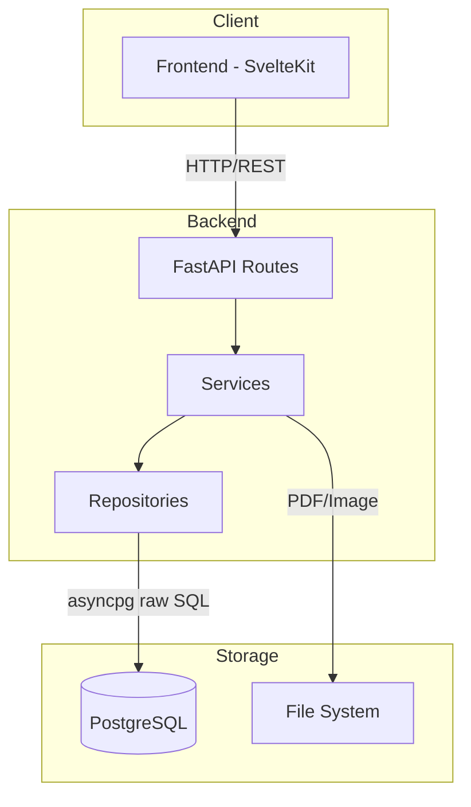
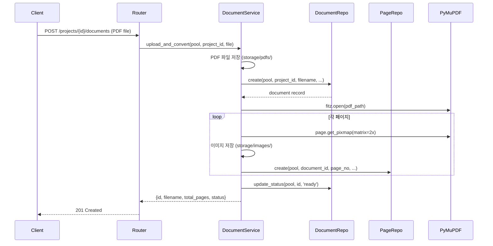
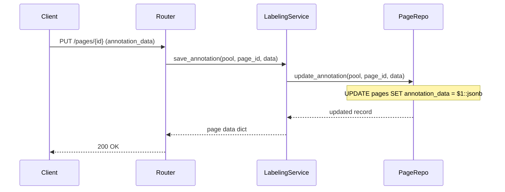
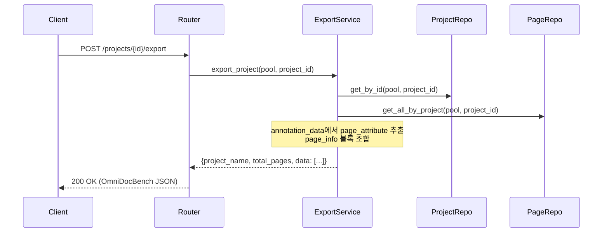

# 아키텍처

## 시스템 구조



## 레이어드 아키텍처

saegim 백엔드는 3계층 구조를 따릅니다:

### Routes (API 라우터)

HTTP 요청을 받아 적절한 서비스를 호출하고 응답을 반환합니다.

```text
src/saegim/api/routes/
├── health.py       # GET /api/v1/health
├── projects.py     # 프로젝트 CRUD (project_type 포함)
├── documents.py    # 문서 업로드/조회
├── pages.py        # 페이지 레이블링
├── users.py        # 사용자 관리
├── analysis.py     # Phase 4a: 문서 분석 메타데이터 CRUD
└── export.py       # 데이터 내보내기 (OmniDocBench / VQA / OCRAG)
```

- FastAPI의 `APIRouter`를 사용
- Pydantic 스키마로 요청/응답 검증
- 모든 엔드포인트는 `/api/v1` 접두사

### Services (비즈니스 로직)

핵심 비즈니스 로직을 처리합니다.

```text
src/saegim/services/
├── document_service.py    # PDF 업로드 → 이미지 변환 → DB 저장
├── labeling_service.py    # 어노테이션 CRUD, 요소 추가/삭제
├── analysis_service.py    # Phase 4a: AI 문서 분석 (Overview, Core Idea, Key Figures, Limitations)
└── export_service.py      # OmniDocBench JSON 조합 (Strategy 패턴으로 VQA/OCRAG Export 확장)
```

- Repository를 호출하여 데이터 접근
- 파일 시스템 I/O 처리 (PDF 저장, 이미지 변환)
- JSONB 데이터의 JSON string/dict 파싱 처리

### Repositories (데이터 접근)

asyncpg를 사용하여 PostgreSQL에 raw SQL을 실행합니다.

```text
src/saegim/repositories/
├── project_repo.py    # INSERT/SELECT projects
├── document_repo.py   # INSERT/SELECT/UPDATE documents
├── page_repo.py       # JSONB 연산 (jsonb_set, jsonb_agg)
└── user_repo.py       # INSERT/SELECT users
```

- 모든 함수는 `asyncpg.Pool`을 첫 번째 인자로 받음
- SQL 파라미터는 `$1`, `$2` 등 positional binding 사용
- `asyncpg.Record` 객체 반환

## 데이터 흐름

### PDF 업로드 플로우



### 어노테이션 저장 플로우



### 내보내기 플로우



## 커넥션 풀 관리

asyncpg 커넥션 풀은 FastAPI lifespan으로 관리됩니다:

```python
@asynccontextmanager
async def lifespan(app: FastAPI) -> AsyncIterator[None]:
    settings = app.state.settings
    await create_pool(
        settings.database_url,
        min_size=settings.db_pool_min_size,  # 기본값: 2
        max_size=settings.db_pool_max_size,  # 기본값: 10
    )
    yield
    await close_pool()
```

- 앱 시작 시 풀 생성, 종료 시 풀 해제
- `get_pool()` 함수로 모듈 레벨 풀 접근
- Repository 함수는 풀을 인자로 받아 커넥션 획득

## 정적 파일 서빙

페이지 이미지는 FastAPI `StaticFiles`로 제공됩니다:

```text
/storage/images/{document_id}_p{page_no}.png
```

`storage/images/` 디렉토리가 `/storage/images` 경로로 마운트됩니다.
