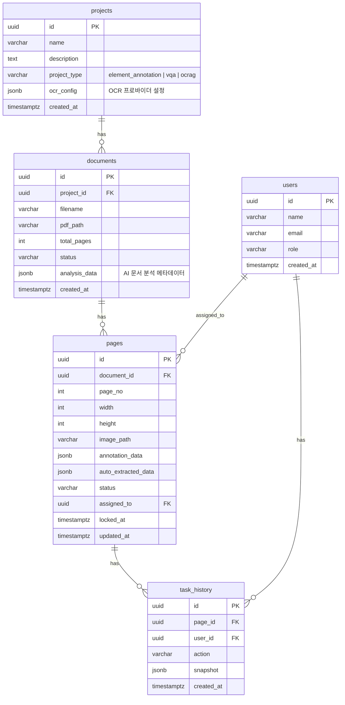

# 데이터베이스

## 개요

saegim은 PostgreSQL을 사용하며, asyncpg로 raw SQL을 직접 실행합니다.
ORM 없이 순수 SQL과 JSONB를 활용합니다.

## ER 다이어그램



## 테이블 상세

### projects

프로젝트 단위로 문서를 관리합니다.

| 컬럼 | 타입 | 기본값 | 설명 |
| ------ | ------ | -------- | ------ |
| `id` | UUID PK | `uuid_generate_v4()` | 프로젝트 ID |
| `name` | VARCHAR(255) | - | 프로젝트 이름 |
| `description` | TEXT | `''` | 프로젝트 설명 |
| `project_type` | VARCHAR(30) | `'element_annotation'` | 프로젝트 유형: `element_annotation`, `vqa`, `ocrag` |
| `ocr_config` | JSONB | `NULL` | OCR 프로바이더 설정 (provider, API key, host/port) |
| `created_at` | TIMESTAMPTZ | `NOW()` | 생성 시각 |

### documents

PDF 문서 정보를 저장합니다.

| 컬럼 | 타입 | 기본값 | 설명 |
| ------ | ------ | -------- | ------ |
| `id` | UUID PK | `uuid_generate_v4()` | 문서 ID |
| `project_id` | UUID FK | - | 소속 프로젝트 |
| `filename` | VARCHAR(512) | - | 원본 파일명 |
| `pdf_path` | VARCHAR(1024) | - | PDF 저장 경로 |
| `total_pages` | INT | `0` | 총 페이지 수 |
| `status` | VARCHAR(20) | `'uploading'` | 문서 상태 |
| `analysis_data` | JSONB | `'{}'` | AI 문서 분석 메타데이터 (Overview, Core Idea, Key Figures, Limitations) |
| `created_at` | TIMESTAMPTZ | `NOW()` | 생성 시각 |

**status 값:**

| 값 | 설명 |
| ---- | ------ |
| `uploading` | 업로드 중 |
| `processing` | 이미지 변환 중 |
| `ready` | 변환 완료, 레이블링 가능 |
| `error` | 변환 실패 |

**인덱스:**

- `idx_documents_project_id` - `project_id` (프로젝트별 조회)

### pages

페이지별 어노테이션 데이터를 저장합니다. 핵심 테이블입니다.

| 컬럼 | 타입 | 기본값 | 설명 |
| ------ | ------ | -------- | ------ |
| `id` | UUID PK | `uuid_generate_v4()` | 페이지 ID |
| `document_id` | UUID FK | - | 소속 문서 |
| `page_no` | INT | - | 페이지 번호 (1부터) |
| `width` | INT | `0` | 이미지 너비 (px) |
| `height` | INT | `0` | 이미지 높이 (px) |
| `image_path` | VARCHAR(1024) | `''` | 이미지 경로 |
| `annotation_data` | JSONB | `'{}'` | OmniDocBench 어노테이션 |
| `auto_extracted_data` | JSONB | `NULL` | 자동 추출 결과 |
| `status` | VARCHAR(20) | `'pending'` | 레이블링 상태 |
| `assigned_to` | UUID FK | `NULL` | 할당된 사용자 |
| `locked_at` | TIMESTAMPTZ | `NULL` | 잠금 시각 |
| `updated_at` | TIMESTAMPTZ | `NOW()` | 최종 수정 시각 |

**status 값:**

| 값 | 설명 |
| ---- | ------ |
| `pending` | 미할당/미시작 |
| `in_progress` | 레이블링 진행 중 |
| `submitted` | 제출 완료 |
| `reviewed` | 검토 완료 |

**인덱스:**

- `idx_pages_document_id` - `document_id` (문서별 조회)
- `idx_pages_status` - `status` (상태별 필터링)
- `idx_pages_assigned_to` - `assigned_to` (사용자별 할당 조회)
- `idx_pages_annotation` - `annotation_data` GIN (JSONB 검색)

### users

사용자 정보를 저장합니다.

| 컬럼 | 타입 | 기본값 | 설명 |
| ------ | ------ | -------- | ------ |
| `id` | UUID PK | `uuid_generate_v4()` | 사용자 ID |
| `name` | VARCHAR(255) | - | 이름 |
| `email` | VARCHAR(255) UNIQUE | - | 이메일 |
| `role` | VARCHAR(20) | `'annotator'` | 역할 |
| `created_at` | TIMESTAMPTZ | `NOW()` | 생성 시각 |

**role 값:** `admin`, `annotator`, `reviewer`

### task_history

작업 이력을 추적합니다.

| 컬럼 | 타입 | 기본값 | 설명 |
| ------ | ------ | -------- | ------ |
| `id` | UUID PK | `uuid_generate_v4()` | 이력 ID |
| `page_id` | UUID FK | - | 대상 페이지 |
| `user_id` | UUID FK | - | 작업 사용자 |
| `action` | VARCHAR(20) | - | 작업 유형 |
| `snapshot` | JSONB | `NULL` | 시점 스냅샷 |
| `created_at` | TIMESTAMPTZ | `NOW()` | 발생 시각 |

**action 값:** `assigned`, `started`, `saved`, `submitted`, `approved`, `rejected`

## JSONB 연산

### annotation_data 전체 업데이트

```sql
UPDATE pages
SET annotation_data = $1::jsonb, updated_at = NOW()
WHERE id = $2
```

### page_attribute 부분 업데이트

`jsonb_set`으로 `annotation_data` 내부의 `page_attribute`만 교체합니다:

```sql
UPDATE pages
SET annotation_data = jsonb_set(
    COALESCE(annotation_data, '{}'::jsonb),
    '{page_attribute}',
    $1::jsonb
), updated_at = NOW()
WHERE id = $2
```

### layout_dets에 요소 추가

기존 배열에 새 요소를 `||` 연산자로 append합니다:

```sql
UPDATE pages
SET annotation_data = jsonb_set(
    COALESCE(annotation_data, '{"layout_dets": []}'::jsonb),
    '{layout_dets}',
    COALESCE(annotation_data->'layout_dets', '[]'::jsonb) || $1::jsonb
), updated_at = NOW()
WHERE id = $2
```

### layout_dets에서 요소 삭제

`jsonb_agg`와 `jsonb_array_elements`로 `anno_id`가 일치하지 않는 요소만 필터링합니다:

```sql
UPDATE pages
SET annotation_data = jsonb_set(
    annotation_data,
    '{layout_dets}',
    (
        SELECT COALESCE(jsonb_agg(elem), '[]'::jsonb)
        FROM jsonb_array_elements(annotation_data->'layout_dets') AS elem
        WHERE (elem->>'anno_id')::int != $1
    )
), updated_at = NOW()
WHERE id = $2
```

### auto_extracted_data 수락 (annotation_data로 복사)

`auto_extracted_data`를 `annotation_data`로 복사합니다.
기존 annotation이 비어있을 때만 동작합니다:

```sql
UPDATE pages
SET annotation_data = auto_extracted_data, updated_at = NOW()
WHERE id = $1
  AND auto_extracted_data IS NOT NULL
  AND (
    annotation_data IS NULL
    OR annotation_data = '{}'::jsonb
    OR NOT (annotation_data ? 'layout_dets')
    OR jsonb_array_length(COALESCE(annotation_data->'layout_dets', '[]'::jsonb)) = 0
  )
RETURNING ...
```

이미 `annotation_data.layout_dets`에 요소가 있으면 업데이트하지 않고 `NULL`을 반환합니다
(API에서 409 Conflict로 처리).

## analysis_data JSONB 구조 (Phase 4a)

`documents.analysis_data`에 저장되는 문서 분석 메타데이터입니다.
외부 AI(VLM/LLM)가 자동 추출하고 사람이 검수합니다.

```json
{
  "overview": {
    "title": "논문 제목",
    "authors": ["저자 1", "저자 2"],
    "venue": "학회/저널",
    "summary": "1~2문장 요약",
    "tags": ["keyword1", "keyword2"]
  },
  "core_idea": {
    "problem": "해결하려는 문제",
    "approach": "접근 방법",
    "novelty": "핵심 기여/차별점",
    "key_equations": [
      {"page": 3, "anno_id": 7, "description": "수식 설명"}
    ]
  },
  "key_figures": [
    {
      "page": 2,
      "anno_id": 3,
      "label": "Figure 1",
      "why_important": "이 그림이 중요한 이유",
      "rank": 1
    }
  ],
  "limitations": {
    "stated": ["논문에서 명시한 한계"],
    "implicit": ["암시적 한계"],
    "future_work": ["향후 연구 방향"]
  },
  "_meta": {
    "model": "claude-sonnet-4-5-20250929",
    "extracted_at": "2026-02-15T10:00:00Z",
    "reviewed": false,
    "reviewed_by": null
  }
}
```

`key_figures`의 `page` + `anno_id`가 해당 문서 pages의 `annotation_data.layout_dets[]`를
참조하여 document-level과 page-level을 연결합니다.

### analysis_data 업데이트

```sql
-- 전체 업데이트
UPDATE documents
SET analysis_data = $1::jsonb
WHERE id = $2

-- 특정 섹션만 업데이트 (예: key_figures)
UPDATE documents
SET analysis_data = jsonb_set(
    COALESCE(analysis_data, '{}'::jsonb),
    '{key_figures}',
    $1::jsonb
)
WHERE id = $2
```

## 마이그레이션

SQL 파일 기반으로 수동 관리합니다:

```text
migrations/
└── 001_init.sql  # 전체 스키마 (projects, users, documents, pages, task_history)
```

실행 방법:

```bash
# psql로 직접 실행
psql -U labeling -d labeling -f migrations/001_init.sql
```

프로그래밍 방식 실행 (`database.run_migrations`):

```python
from saegim.core.database import run_migrations

await run_migrations(pool, migrations_dir='migrations')
```

이 함수는 `migrations/` 디렉토리의 `.sql` 파일을 이름순으로 정렬하여 순차 실행합니다.
