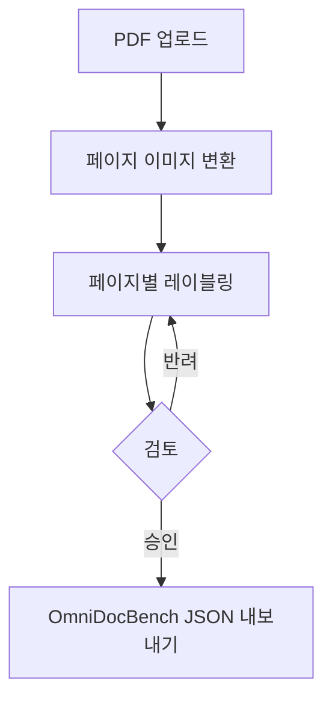

# 개요

## 배경

한국어 문서 VLM 벤치마크를 구축하려면 문서의 레이아웃 요소(제목, 본문, 표, 수식 등)를
사람이 직접 어노테이션해야 합니다. saegim은 이 과정을 체계적으로 관리하는 플랫폼입니다.

## OmniDocBench 포맷

saegim은 [OmniDocBench](https://github.com/opendatalab/OmniDocBench) 포맷을 사용합니다.
각 페이지의 어노테이션 데이터는 다음 구조를 따릅니다:

```json
{
  "layout_dets": [
    {
      "category_type": "text_block",
      "poly": [x1, y1, x2, y2, x3, y3, x4, y4],
      "ignore": false,
      "order": 0,
      "anno_id": 0,
      "text": "본문 텍스트",
      "attribute": {
        "text_language": "text_ko",
        "text_background": "white",
        "text_rotate": "normal"
      },
      "line_with_spans": [],
      "merge_list": [],
      "latex": "",
      "html": ""
    }
  ],
  "page_attribute": {
    "data_source": "academic_literature",
    "language": "ko",
    "layout": "single_column",
    "watermark": false,
    "fuzzy_scan": false,
    "colorful_background": false
  },
  "extra": {
    "relation": []
  }
}
```

### 블록 레벨 카테고리 (15종)

| 카테고리 | 설명 |
|----------|------|
| `title` | 제목 |
| `text_block` | 본문 텍스트 블록 |
| `figure` | 그림/이미지 |
| `figure_caption` | 그림 캡션 |
| `table` | 표 |
| `table_caption` | 표 캡션 |
| `table_footnote` | 표 각주 |
| `equation_isolated` | 독립 수식 |
| `equation_caption` | 수식 번호/캡션 |
| `header` | 페이지 헤더 |
| `footer` | 페이지 푸터 |
| `page_number` | 페이지 번호 |
| `reference` | 참고문헌 |
| `abstract` | 초록 |
| `code_block` | 코드 블록 |

### 스팬 레벨 카테고리 (4종)

| 카테고리 | 설명 |
|----------|------|
| `text_span` | 텍스트 스팬 |
| `equation_inline` | 인라인 수식 |
| `footnote_mark` | 각주 표시 |
| `reference_mark` | 참조 표시 |

## 워크플로우



1. **PDF 업로드**: 프로젝트에 PDF 문서를 업로드합니다
2. **이미지 변환**: PyMuPDF가 각 페이지를 2배 해상도 PNG로 변환합니다
3. **레이블링**: 어노테이터가 각 페이지의 레이아웃 요소를 표시합니다
4. **검토**: 리뷰어가 어노테이션을 검토합니다
5. **내보내기**: 완성된 데이터를 OmniDocBench JSON으로 내보냅니다

## 설계 원칙

- **SQLAlchemy 없이 raw SQL**: asyncpg로 PostgreSQL에 직접 raw SQL 실행
- **JSONB 활용**: 어노테이션 데이터를 PostgreSQL JSONB 컬럼에 저장
- **레이어드 아키텍처**: Repository → Service → Router 계층 분리
- **비동기 처리**: asyncpg + FastAPI의 async/await 기반
